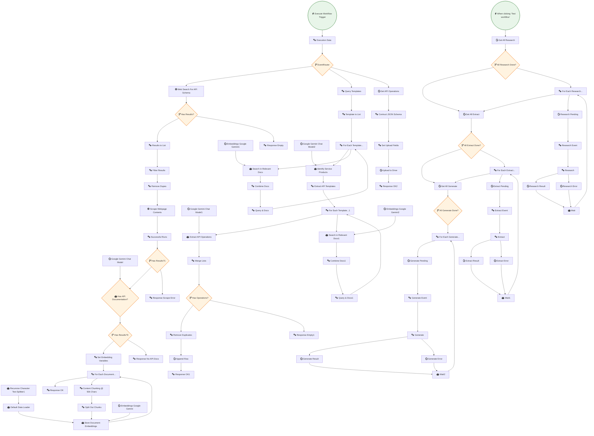

```mermaid
graph TD
    classDef trigger fill:#e8f5e9,stroke:#2e7d32,stroke-width:2px;
    classDef ai fill:#e3f2fd,stroke:#1565c0,stroke-width:2px;
    classDef logic fill:#fff3e0,stroke:#ef6c00,stroke-width:2px;

    When_clicking__Test_workflow_(("fas:fa-bolt When clicking ‘Test workflow’")):::trigger
    Web_Search_For_API_Schema["fas:fa-globe Web Search For API Schema"]
    Scrape_Webpage_Contents["fas:fa-globe Scrape Webpage Contents"]
    Results_to_List["fas:fa-cogs Results to List"]
    Recursive_Character_Text_Splitter1["fas:fa-robot Recursive Character Text Splitter1"]
    Content_Chunking___50k_Chars["fas:fa-cogs Content Chunking @ 50k Chars"]
    Split_Out_Chunks["fas:fa-cogs Split Out Chunks"]
    Default_Data_Loader["fas:fa-robot Default Data Loader"]
    Set_Embedding_Variables["fas:fa-cogs Set Embedding Variables"]
    Execute_Workflow_Trigger(("fas:fa-bolt Execute Workflow Trigger")):::trigger
    Execution_Data["fas:fa-cogs Execution Data"]
    EventRouter{"fas:fa-code-branch EventRouter"}:::logic
    Google_Gemini_Chat_Model["fab:fa-google Google Gemini Chat Model"]
    Successful_Runs["fas:fa-cogs Successful Runs"]
    For_Each_Document___["fas:fa-cogs For Each Document..."]
    Embeddings_Google_Gemini["fab:fa-google Embeddings Google Gemini"]
    Has_API_Documentation_{"fas:fa-robot Has API Documentation?"}:::logic
    Store_Document_Embeddings["fas:fa-robot Store Document Embeddings"]
    Embeddings_Google_Gemini1["fab:fa-google Embeddings Google Gemini1"]
    Google_Gemini_Chat_Model1["fab:fa-google Google Gemini Chat Model1"]
    Extract_API_Operations["fas:fa-robot Extract API Operations"]
    Search_in_Relevant_Docs["fas:fa-robot Search in Relevant Docs"]
    Wait["fas:fa-robot Wait"]
    Remove_Dupes["fas:fa-cogs Remove Dupes"]
    Filter_Results["fas:fa-cogs Filter Results"]
    Research["fas:fa-cogs Research"]
    Has_Results_{"fas:fa-code-branch Has Results?"}:::logic
    Response_Empty["fas:fa-cogs Response Empty"]
    Response_OK["fas:fa-cogs Response OK"]
    Combine_Docs["fas:fa-cogs Combine Docs"]
    Template_to_List["fas:fa-cogs Template to List"]
    Query_Templates["fas:fa-cogs Query Templates"]
    Google_Gemini_Chat_Model2["fab:fa-google Google Gemini Chat Model2"]
    For_Each_Template___["fas:fa-cogs For Each Template..."]
    Query___Docs["fas:fa-cogs Query & Docs"]
    Identify_Service_Products["fas:fa-robot Identify Service Products"]
    Extract_API_Templates["fas:fa-cogs Extract API Templates"]
    Embeddings_Google_Gemini2["fab:fa-google Embeddings Google Gemini2"]
    Search_in_Relevant_Docs1["fas:fa-robot Search in Relevant Docs1"]
    Combine_Docs1["fas:fa-cogs Combine Docs1"]
    Query___Docs1["fas:fa-cogs Query & Docs1"]
    For_Each_Template___1["fas:fa-cogs For Each Template...1"]
    Merge_Lists["fas:fa-cogs Merge Lists"]
    Remove_Duplicates["fas:fa-cogs Remove Duplicates"]
    Append_Row["fab:fa-google Append Row"]
    Response_OK1["fas:fa-cogs Response OK1"]
    Has_Operations_{"fas:fa-code-branch Has Operations?"}:::logic
    Response_Empty1["fas:fa-cogs Response Empty1"]
    Research_Pending["fab:fa-google Research Pending"]
    Research_Result["fab:fa-google Research Result"]
    Research_Error["fab:fa-google Research Error"]
    Extract_Pending["fab:fa-google Extract Pending"]
    Research_Event["fas:fa-cogs Research Event"]
    Extract_Event["fas:fa-cogs Extract Event"]
    Extract["fas:fa-cogs Extract"]
    Extract_Result["fab:fa-google Extract Result"]
    Extract_Error["fab:fa-google Extract Error"]
    Get_API_Operations["fab:fa-google Get API Operations"]
    Contruct_JSON_Schema["fas:fa-cogs Contruct JSON Schema"]
    Upload_to_Drive["fab:fa-google Upload to Drive"]
    Set_Upload_Fields["fas:fa-cogs Set Upload Fields"]
    Response_OK2["fas:fa-cogs Response OK2"]
    Generate_Event["fas:fa-cogs Generate Event"]
    Generate_Pending["fab:fa-google Generate Pending"]
    Generate["fas:fa-cogs Generate"]
    Generate_Error["fab:fa-google Generate Error"]
    Generate_Result["fab:fa-google Generate Result"]
    Get_All_Extract["fab:fa-google Get All Extract"]
    Get_All_Research["fab:fa-google Get All Research"]
    For_Each_Research___["fas:fa-cogs For Each Research..."]
    For_Each_Extract___["fas:fa-cogs For Each Extract..."]
    Wait1["fas:fa-robot Wait1"]
    All_Research_Done_{"fas:fa-code-branch All Research Done?"}:::logic
    All_Extract_Done_{"fas:fa-code-branch All Extract Done?"}:::logic
    Get_All_Generate["fab:fa-google Get All Generate"]
    All_Generate_Done_{"fas:fa-code-branch All Generate Done?"}:::logic
    For_Each_Generate___["fas:fa-cogs For Each Generate..."]
    Wait2["fas:fa-robot Wait2"]
    Has_Results_1{"fas:fa-code-branch Has Results?1"}:::logic
    Response_Scrape_Error["fas:fa-cogs Response Scrape Error"]
    Has_Results_3{"fas:fa-code-branch Has Results?3"}:::logic
    Response_No_API_Docs["fas:fa-cogs Response No API Docs"]

    Wait --> For_Each_Research___
    Wait1 --> For_Each_Extract___
    Wait2 --> For_Each_Generate___
    Extract --> Extract_Result
    Extract --> Extract_Error
    Generate --> Generate_Result
    Generate --> Generate_Error
    Research --> Research_Result
    Research --> Research_Error
    Append_Row --> Response_OK1
    EventRouter --> Web_Search_For_API_Schema
    EventRouter --> Query_Templates
    EventRouter --> Get_API_Operations
    Merge_Lists --> Has_Operations_
    Combine_Docs --> Query___Docs
    Has_Results_ --> Results_to_List
    Has_Results_ --> Response_Empty
    Query___Docs --> For_Each_Template___
    Remove_Dupes --> Scrape_Webpage_Contents
    Combine_Docs1 --> Query___Docs1
    Extract_Error --> Wait1
    Extract_Event --> Extract
    Has_Results_1 --> Has_API_Documentation_
    Has_Results_1 --> Response_Scrape_Error
    Has_Results_3 --> Set_Embedding_Variables
    Has_Results_3 --> Response_No_API_Docs
    Query___Docs1 --> For_Each_Template___1
    Execution_Data --> EventRouter
    Extract_Result --> Wait1
    Filter_Results --> Remove_Dupes
    Generate_Error --> Wait2
    Generate_Event --> Generate
    Research_Error --> Wait
    Research_Event --> Research
    Extract_Pending --> Extract_Event
    Generate_Result --> Wait2
    Get_All_Extract --> All_Extract_Done_
    Has_Operations_ --> Remove_Duplicates
    Has_Operations_ --> Response_Empty1
    Query_Templates --> Template_to_List
    Research_Result --> Wait
    Results_to_List --> Filter_Results
    Successful_Runs --> Has_Results_1
    Upload_to_Drive --> Response_OK2
    Generate_Pending --> Generate_Event
    Get_All_Generate --> All_Generate_Done_
    Get_All_Research --> All_Research_Done_
    Research_Pending --> Research_Event
    Split_Out_Chunks --> Store_Document_Embeddings
    Template_to_List --> For_Each_Template___
    All_Extract_Done_ --> Get_All_Generate
    All_Extract_Done_ --> For_Each_Extract___
    Remove_Duplicates --> Append_Row
    Set_Upload_Fields --> Upload_to_Drive
    All_Generate_Done_ --> For_Each_Generate___
    All_Research_Done_ --> Get_All_Extract
    All_Research_Done_ --> For_Each_Research___
    Get_API_Operations --> Contruct_JSON_Schema
    Default_Data_Loader --> Store_Document_Embeddings
    For_Each_Extract___ --> Get_All_Generate
    For_Each_Extract___ --> Extract_Pending
    Contruct_JSON_Schema --> Set_Upload_Fields
    For_Each_Document___ --> Response_OK
    For_Each_Document___ --> Content_Chunking___50k_Chars
    For_Each_Generate___ --> Generate_Pending
    For_Each_Research___ --> Get_All_Extract
    For_Each_Research___ --> Research_Pending
    For_Each_Template___ --> Identify_Service_Products
    For_Each_Template___ --> Search_in_Relevant_Docs
    Extract_API_Templates --> For_Each_Template___1
    For_Each_Template___1 --> Extract_API_Operations
    For_Each_Template___1 --> Search_in_Relevant_Docs1
    Extract_API_Operations --> Merge_Lists
    Has_API_Documentation_ --> Has_Results_3
    Scrape_Webpage_Contents --> Successful_Runs
    Search_in_Relevant_Docs --> Combine_Docs
    Set_Embedding_Variables --> For_Each_Document___
    Embeddings_Google_Gemini --> Store_Document_Embeddings
    Execute_Workflow_Trigger --> Execution_Data
    Google_Gemini_Chat_Model --> Has_API_Documentation_
    Search_in_Relevant_Docs1 --> Combine_Docs1
    Embeddings_Google_Gemini1 --> Search_in_Relevant_Docs
    Embeddings_Google_Gemini2 --> Search_in_Relevant_Docs1
    Google_Gemini_Chat_Model1 --> Extract_API_Operations
    Google_Gemini_Chat_Model2 --> Identify_Service_Products
    Identify_Service_Products --> Extract_API_Templates
    Store_Document_Embeddings --> For_Each_Document___
    Web_Search_For_API_Schema --> Has_Results_
    Content_Chunking___50k_Chars --> Split_Out_Chunks
    When_clicking__Test_workflow_ --> Get_All_Research
    Recursive_Character_Text_Splitter1 --> Default_Data_Loader
```
