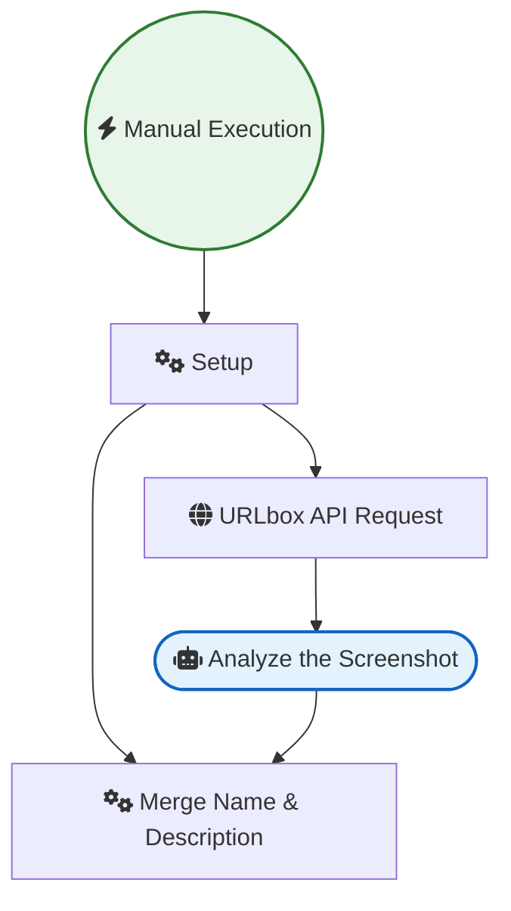

```mermaid
graph TD
    classDef trigger fill:#e8f5e9,stroke:#2e7d32,stroke-width:2px;
    classDef ai fill:#e3f2fd,stroke:#1565c0,stroke-width:2px;
    classDef logic fill:#fff3e0,stroke:#ef6c00,stroke-width:2px;

    Setup["fas:fa-cogs Setup"]
    URLbox_API_Request["fas:fa-globe URLbox API Request"]
    Analyze_the_Screenshot(["fas:fa-robot Analyze the Screenshot"]):::ai
    Merge_Name___Description["fas:fa-cogs Merge Name & Description"]
    Manual_Execution(("fas:fa-bolt Manual Execution")):::trigger

    Setup --> URLbox_API_Request
    Setup --> Merge_Name___Description
    Manual_Execution --> Setup
    URLbox_API_Request --> Analyze_the_Screenshot
    Analyze_the_Screenshot --> Merge_Name___Description
```
