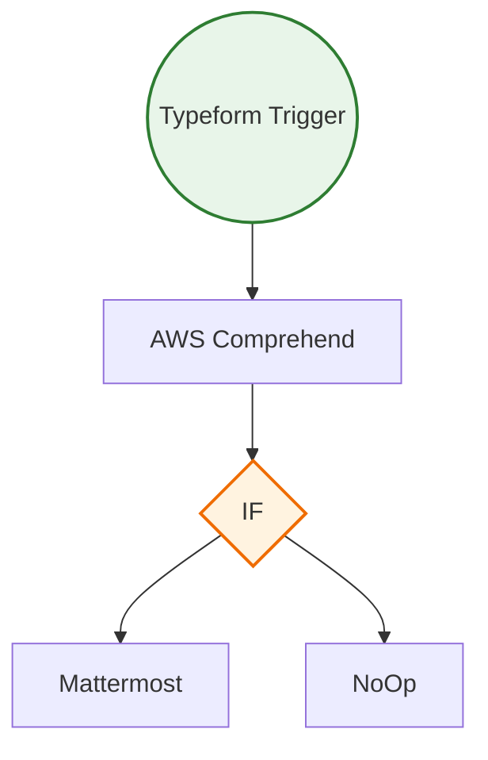

```mermaid
graph TD
    classDef trigger fill:#e8f5e9,stroke:#2e7d32,stroke-width:2px;
    classDef ai fill:#e3f2fd,stroke:#1565c0,stroke-width:2px;
    classDef logic fill:#fff3e0,stroke:#ef6c00,stroke-width:2px;

    Mattermost["Mattermost"]
    NoOp["NoOp"]
    IF{"IF"}:::logic
    AWS_Comprehend["AWS Comprehend"]
    Typeform_Trigger(("Typeform Trigger")):::trigger

    IF --> Mattermost
    IF --> NoOp
    AWS_Comprehend --> IF
    Typeform_Trigger --> AWS_Comprehend
```
