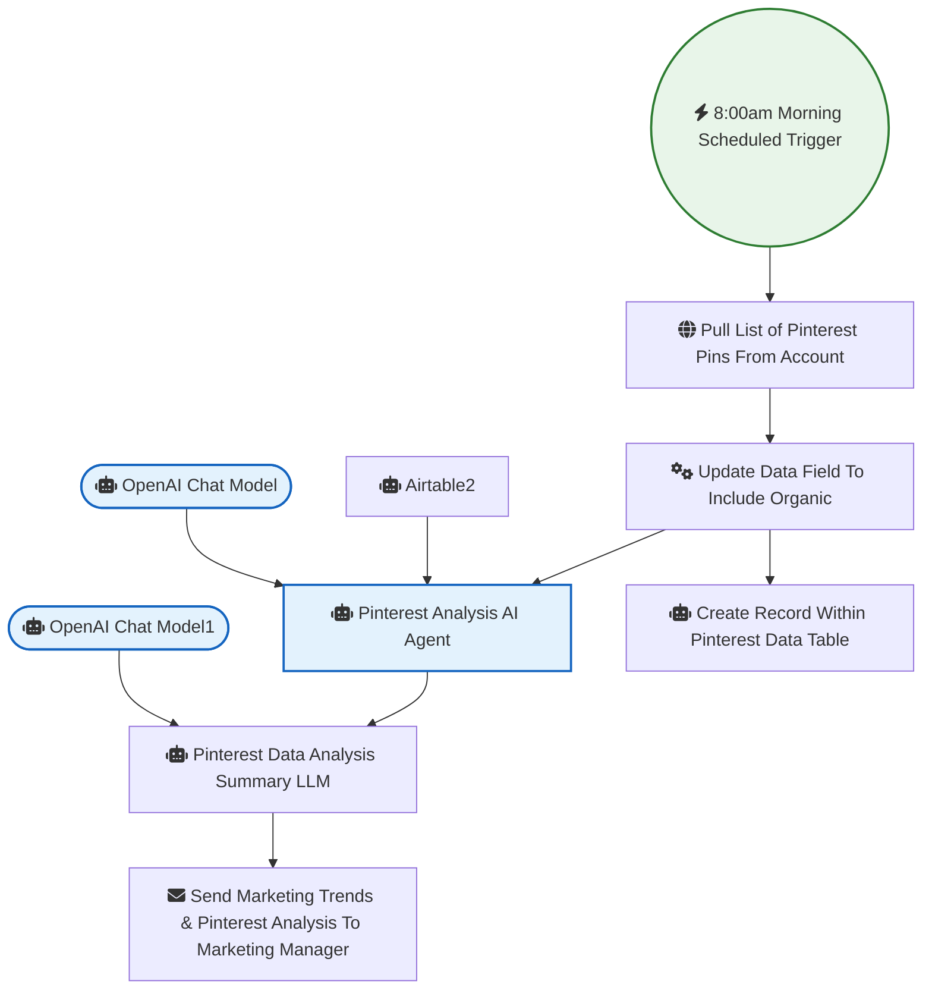

```mermaid
graph TD
    classDef trigger fill:#e8f5e9,stroke:#2e7d32,stroke-width:2px;
    classDef ai fill:#e3f2fd,stroke:#1565c0,stroke-width:2px;
    classDef logic fill:#fff3e0,stroke:#ef6c00,stroke-width:2px;

    OpenAI_Chat_Model(["fas:fa-robot OpenAI Chat Model"]):::ai
    Airtable2["fas:fa-robot Airtable2"]
    OpenAI_Chat_Model1(["fas:fa-robot OpenAI Chat Model1"]):::ai
    n_8_00am_Morning_Scheduled_Trigger(("fas:fa-bolt 8:00am Morning Scheduled Trigger")):::trigger
    Pull_List_of_Pinterest_Pins_From_Account["fas:fa-globe Pull List of Pinterest Pins From Account"]
    Update_Data_Field_To_Include_Organic["fas:fa-cogs Update Data Field To Include Organic"]
    Create_Record_Within_Pinterest_Data_Table["fas:fa-robot Create Record Within Pinterest Data Table"]
    Pinterest_Analysis_AI_Agent["fas:fa-robot Pinterest Analysis AI Agent"]:::ai
    Pinterest_Data_Analysis_Summary_LLM["fas:fa-robot Pinterest Data Analysis Summary LLM"]
    Send_Marketing_Trends___Pinterest_Analysis_To_Marketing_Manager["fas:fa-envelope Send Marketing Trends & Pinterest Analysis To Marketing Manager"]

    Airtable2 --> Pinterest_Analysis_AI_Agent
    OpenAI_Chat_Model --> Pinterest_Analysis_AI_Agent
    OpenAI_Chat_Model1 --> Pinterest_Data_Analysis_Summary_LLM
    Pinterest_Analysis_AI_Agent --> Pinterest_Data_Analysis_Summary_LLM
    n_8_00am_Morning_Scheduled_Trigger --> Pull_List_of_Pinterest_Pins_From_Account
    Pinterest_Data_Analysis_Summary_LLM --> Send_Marketing_Trends___Pinterest_Analysis_To_Marketing_Manager
    Update_Data_Field_To_Include_Organic --> Create_Record_Within_Pinterest_Data_Table
    Update_Data_Field_To_Include_Organic --> Pinterest_Analysis_AI_Agent
    Pull_List_of_Pinterest_Pins_From_Account --> Update_Data_Field_To_Include_Organic
```
