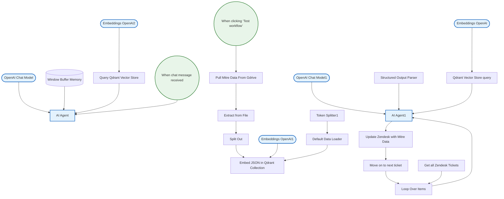

```mermaid
graph TD
    classDef trigger fill:#e8f5e9,stroke:#2e7d32,stroke-width:2px;
    classDef ai fill:#e3f2fd,stroke:#1565c0,stroke-width:2px;
    classDef logic fill:#fff3e0,stroke:#ef6c00,stroke-width:2px;

    When_chat_message_received(("When chat message received")):::trigger
    AI_Agent["AI Agent"]:::ai
    OpenAI_Chat_Model(["OpenAI Chat Model"]):::ai
    Split_Out["Split Out"]
    Embeddings_OpenAI1(["Embeddings OpenAI1"]):::ai
    Default_Data_Loader["Default Data Loader"]
    Token_Splitter1["Token Splitter1"]
    Window_Buffer_Memory[("Window Buffer Memory")]
    Embeddings_OpenAI2(["Embeddings OpenAI2"]):::ai
    Extract_from_File["Extract from File"]
    When_clicking__Test_workflow_(("When clicking ‘Test workflow’")):::trigger
    AI_Agent1["AI Agent1"]:::ai
    OpenAI_Chat_Model1(["OpenAI Chat Model1"]):::ai
    Embeddings_OpenAI(["Embeddings OpenAI"]):::ai
    Loop_Over_Items["Loop Over Items"]
    Structured_Output_Parser["Structured Output Parser"]
    Pull_Mitre_Data_From_Gdrive["Pull Mitre Data From Gdrive"]
    Embed_JSON_in_Qdrant_Collection["Embed JSON in Qdrant Collection"]
    Query_Qdrant_Vector_Store["Query Qdrant Vector Store"]
    Qdrant_Vector_Store_query["Qdrant Vector Store query"]
    Get_all_Zendesk_Tickets["Get all Zendesk Tickets"]
    Update_Zendesk_with_Mitre_Data["Update Zendesk with Mitre Data"]
    Move_on_to_next_ticket["Move on to next ticket"]

    AI_Agent1 --> Update_Zendesk_with_Mitre_Data
    Split_Out --> Embed_JSON_in_Qdrant_Collection
    Loop_Over_Items --> AI_Agent1
    Token_Splitter1 --> Default_Data_Loader
    Embeddings_OpenAI --> Qdrant_Vector_Store_query
    Extract_from_File --> Split_Out
    OpenAI_Chat_Model --> AI_Agent
    Embeddings_OpenAI1 --> Embed_JSON_in_Qdrant_Collection
    Embeddings_OpenAI2 --> Query_Qdrant_Vector_Store
    OpenAI_Chat_Model1 --> AI_Agent1
    Default_Data_Loader --> Embed_JSON_in_Qdrant_Collection
    Window_Buffer_Memory --> AI_Agent
    Move_on_to_next_ticket --> Loop_Over_Items
    Get_all_Zendesk_Tickets --> Loop_Over_Items
    Structured_Output_Parser --> AI_Agent1
    Qdrant_Vector_Store_query --> AI_Agent1
    Query_Qdrant_Vector_Store --> AI_Agent
    When_chat_message_received --> AI_Agent
    Pull_Mitre_Data_From_Gdrive --> Extract_from_File
    Update_Zendesk_with_Mitre_Data --> Move_on_to_next_ticket
    When_clicking__Test_workflow_ --> Pull_Mitre_Data_From_Gdrive
```
