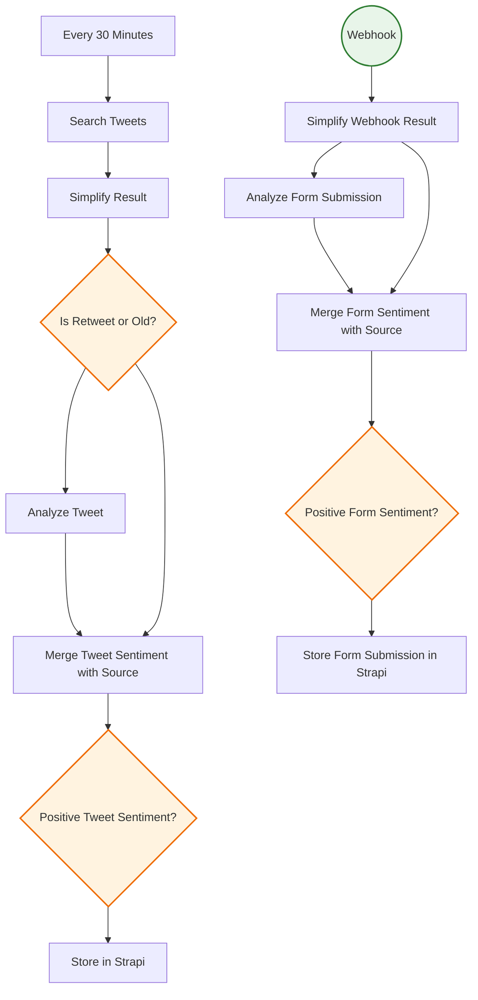

```mermaid
graph TD
    classDef trigger fill:#e8f5e9,stroke:#2e7d32,stroke-width:2px;
    classDef ai fill:#e3f2fd,stroke:#1565c0,stroke-width:2px;
    classDef logic fill:#fff3e0,stroke:#ef6c00,stroke-width:2px;

    Simplify_Result["Simplify Result"]
    Store_in_Strapi["Store in Strapi"]
    Every_30_Minutes["Every 30 Minutes"]
    Is_Retweet_or_Old_{"Is Retweet or Old?"}:::logic
    Search_Tweets["Search Tweets"]
    Webhook(("Webhook")):::trigger
    Simplify_Webhook_Result["Simplify Webhook Result"]
    Analyze_Form_Submission["Analyze Form Submission"]
    Analyze_Tweet["Analyze Tweet"]
    Merge_Form_Sentiment_with_Source["Merge Form Sentiment with Source"]
    Merge_Tweet_Sentiment_with_Source["Merge Tweet Sentiment with Source"]
    Positive_Form_Sentiment_{"Positive Form Sentiment?"}:::logic
    Store_Form_Submission_in_Strapi["Store Form Submission in Strapi"]
    Positive_Tweet_Sentiment_{"Positive Tweet Sentiment?"}:::logic

    Webhook --> Simplify_Webhook_Result
    Analyze_Tweet --> Merge_Tweet_Sentiment_with_Source
    Search_Tweets --> Simplify_Result
    Simplify_Result --> Is_Retweet_or_Old_
    Every_30_Minutes --> Search_Tweets
    Is_Retweet_or_Old_ --> Analyze_Tweet
    Is_Retweet_or_Old_ --> Merge_Tweet_Sentiment_with_Source
    Analyze_Form_Submission --> Merge_Form_Sentiment_with_Source
    Simplify_Webhook_Result --> Analyze_Form_Submission
    Simplify_Webhook_Result --> Merge_Form_Sentiment_with_Source
    Positive_Form_Sentiment_ --> Store_Form_Submission_in_Strapi
    Positive_Tweet_Sentiment_ --> Store_in_Strapi
    Merge_Form_Sentiment_with_Source --> Positive_Form_Sentiment_
    Merge_Tweet_Sentiment_with_Source --> Positive_Tweet_Sentiment_
```
