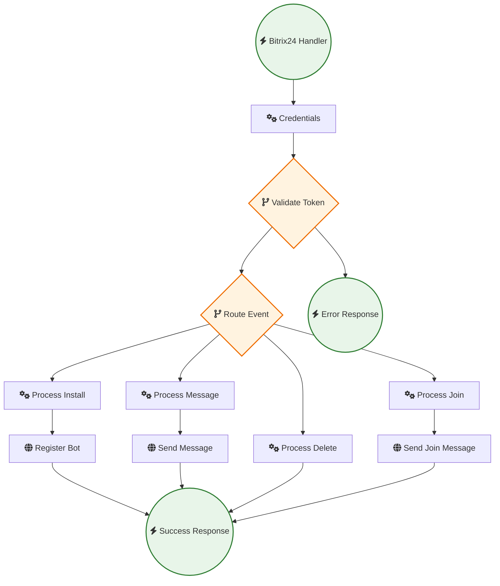

```mermaid
graph TD
    classDef trigger fill:#e8f5e9,stroke:#2e7d32,stroke-width:2px;
    classDef ai fill:#e3f2fd,stroke:#1565c0,stroke-width:2px;
    classDef logic fill:#fff3e0,stroke:#ef6c00,stroke-width:2px;

    Bitrix24_Handler(("fas:fa-bolt Bitrix24 Handler")):::trigger
    Credentials["fas:fa-cogs Credentials"]
    Validate_Token{"fas:fa-code-branch Validate Token"}:::logic
    Route_Event{"fas:fa-code-branch Route Event"}:::logic
    Process_Message["fas:fa-cogs Process Message"]
    Process_Join["fas:fa-cogs Process Join"]
    Process_Install["fas:fa-cogs Process Install"]
    Register_Bot["fas:fa-globe Register Bot"]
    Send_Message["fas:fa-globe Send Message"]
    Send_Join_Message["fas:fa-globe Send Join Message"]
    Process_Delete["fas:fa-cogs Process Delete"]
    Success_Response(("fas:fa-bolt Success Response")):::trigger
    Error_Response(("fas:fa-bolt Error Response")):::trigger

    Credentials --> Validate_Token
    Route_Event --> Process_Message
    Route_Event --> Process_Join
    Route_Event --> Process_Install
    Route_Event --> Process_Delete
    Process_Join --> Send_Join_Message
    Register_Bot --> Success_Response
    Send_Message --> Success_Response
    Process_Delete --> Success_Response
    Validate_Token --> Route_Event
    Validate_Token --> Error_Response
    Process_Install --> Register_Bot
    Process_Message --> Send_Message
    Bitrix24_Handler --> Credentials
    Send_Join_Message --> Success_Response
```
