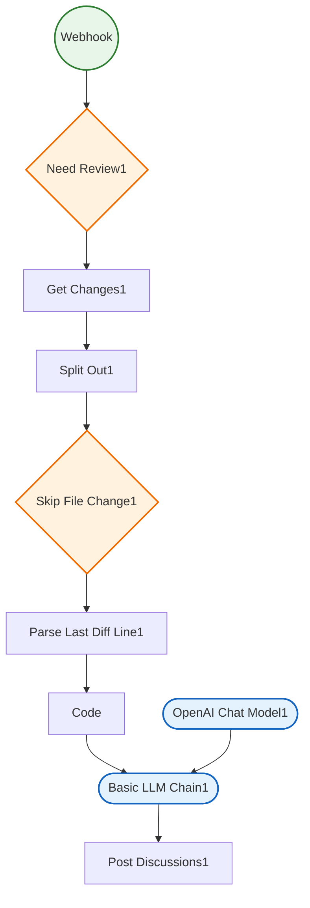

```mermaid
graph TD
    classDef trigger fill:#e8f5e9,stroke:#2e7d32,stroke-width:2px;
    classDef ai fill:#e3f2fd,stroke:#1565c0,stroke-width:2px;
    classDef logic fill:#fff3e0,stroke:#ef6c00,stroke-width:2px;

    Webhook(("Webhook")):::trigger
    Code["Code"]
    Split_Out1["Split Out1"]
    OpenAI_Chat_Model1(["OpenAI Chat Model1"]):::ai
    Get_Changes1["Get Changes1"]
    Skip_File_Change1{"Skip File Change1"}:::logic
    Parse_Last_Diff_Line1["Parse Last Diff Line1"]
    Post_Discussions1["Post Discussions1"]
    Need_Review1{"Need Review1"}:::logic
    Basic_LLM_Chain1(["Basic LLM Chain1"]):::ai

    Code --> Basic_LLM_Chain1
    Webhook --> Need_Review1
    Split_Out1 --> Skip_File_Change1
    Get_Changes1 --> Split_Out1
    Need_Review1 --> Get_Changes1
    Basic_LLM_Chain1 --> Post_Discussions1
    Skip_File_Change1 --> Parse_Last_Diff_Line1
    OpenAI_Chat_Model1 --> Basic_LLM_Chain1
    Parse_Last_Diff_Line1 --> Code
```
