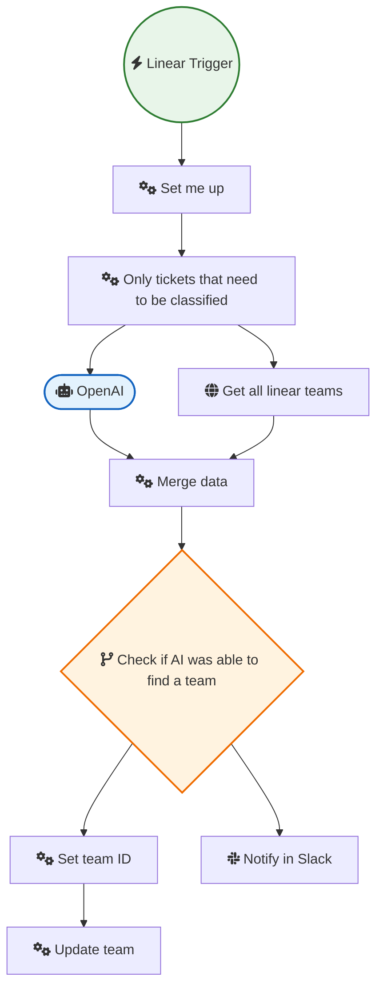

```mermaid
graph TD
    classDef trigger fill:#e8f5e9,stroke:#2e7d32,stroke-width:2px;
    classDef ai fill:#e3f2fd,stroke:#1565c0,stroke-width:2px;
    classDef logic fill:#fff3e0,stroke:#ef6c00,stroke-width:2px;

    Linear_Trigger(("fas:fa-bolt Linear Trigger")):::trigger
    Only_tickets_that_need_to_be_classified["fas:fa-cogs Only tickets that need to be classified"]
    Update_team["fas:fa-cogs Update team"]
    Get_all_linear_teams["fas:fa-globe Get all linear teams"]
    Set_team_ID["fas:fa-cogs Set team ID"]
    Set_me_up["fas:fa-cogs Set me up"]
    Check_if_AI_was_able_to_find_a_team{"fas:fa-code-branch Check if AI was able to find a team"}:::logic
    Notify_in_Slack["fab:fa-slack Notify in Slack"]
    Merge_data["fas:fa-cogs Merge data"]
    OpenAI(["fas:fa-robot OpenAI"]):::ai

    OpenAI --> Merge_data
    Set_me_up --> Only_tickets_that_need_to_be_classified
    Merge_data --> Check_if_AI_was_able_to_find_a_team
    Set_team_ID --> Update_team
    Linear_Trigger --> Set_me_up
    Get_all_linear_teams --> Merge_data
    Check_if_AI_was_able_to_find_a_team --> Set_team_ID
    Check_if_AI_was_able_to_find_a_team --> Notify_in_Slack
    Only_tickets_that_need_to_be_classified --> OpenAI
    Only_tickets_that_need_to_be_classified --> Get_all_linear_teams
```
