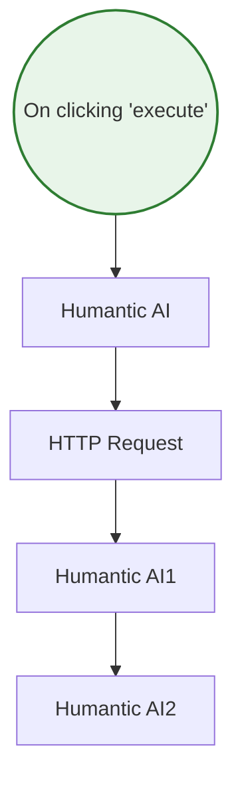

```mermaid
graph TD
    classDef trigger fill:#e8f5e9,stroke:#2e7d32,stroke-width:2px;
    classDef ai fill:#e3f2fd,stroke:#1565c0,stroke-width:2px;
    classDef logic fill:#fff3e0,stroke:#ef6c00,stroke-width:2px;

    On_clicking__execute_(("On clicking 'execute'")):::trigger
    Humantic_AI["Humantic AI"]
    HTTP_Request["HTTP Request"]
    Humantic_AI1["Humantic AI1"]
    Humantic_AI2["Humantic AI2"]

    Humantic_AI --> HTTP_Request
    HTTP_Request --> Humantic_AI1
    Humantic_AI1 --> Humantic_AI2
    On_clicking__execute_ --> Humantic_AI
```
