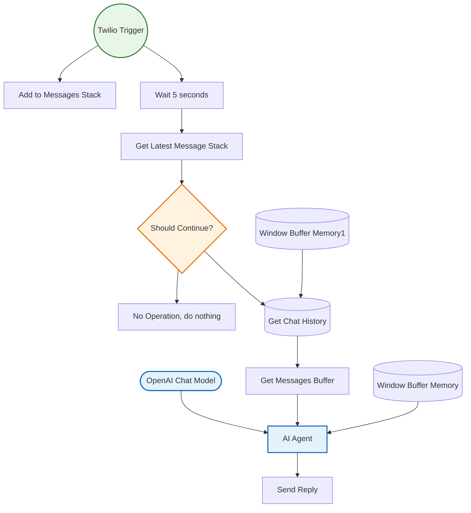

```mermaid
graph TD
    classDef trigger fill:#e8f5e9,stroke:#2e7d32,stroke-width:2px;
    classDef ai fill:#e3f2fd,stroke:#1565c0,stroke-width:2px;
    classDef logic fill:#fff3e0,stroke:#ef6c00,stroke-width:2px;

    OpenAI_Chat_Model(["OpenAI Chat Model"]):::ai
    No_Operation__do_nothing["No Operation, do nothing"]
    Add_to_Messages_Stack["Add to Messages Stack"]
    Should_Continue_{"Should Continue?"}:::logic
    Window_Buffer_Memory[("Window Buffer Memory")]
    Twilio_Trigger(("Twilio Trigger")):::trigger
    Get_Latest_Message_Stack["Get Latest Message Stack"]
    Send_Reply["Send Reply"]
    Wait_5_seconds["Wait 5 seconds"]
    Get_Chat_History[("Get Chat History")]
    Window_Buffer_Memory1[("Window Buffer Memory1")]
    Get_Messages_Buffer["Get Messages Buffer"]
    AI_Agent["AI Agent"]:::ai

    AI_Agent --> Send_Reply
    Twilio_Trigger --> Add_to_Messages_Stack
    Twilio_Trigger --> Wait_5_seconds
    Wait_5_seconds --> Get_Latest_Message_Stack
    Get_Chat_History --> Get_Messages_Buffer
    Should_Continue_ --> Get_Chat_History
    Should_Continue_ --> No_Operation__do_nothing
    OpenAI_Chat_Model --> AI_Agent
    Get_Messages_Buffer --> AI_Agent
    Window_Buffer_Memory --> AI_Agent
    Window_Buffer_Memory1 --> Get_Chat_History
    Get_Latest_Message_Stack --> Should_Continue_
```
