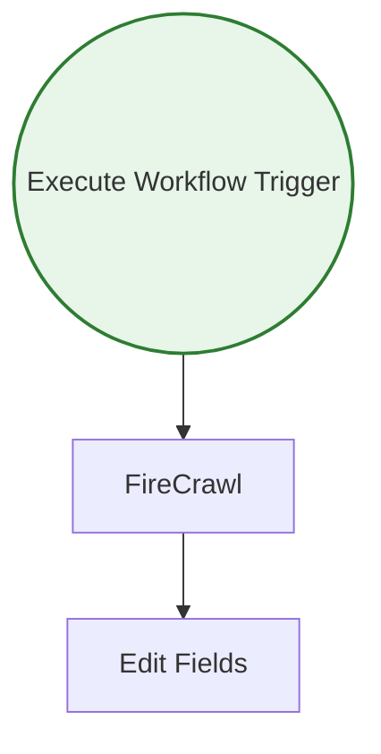

```mermaid
graph TD
    classDef trigger fill:#e8f5e9,stroke:#2e7d32,stroke-width:2px;
    classDef ai fill:#e3f2fd,stroke:#1565c0,stroke-width:2px;
    classDef logic fill:#fff3e0,stroke:#ef6c00,stroke-width:2px;

    Execute_Workflow_Trigger(("Execute Workflow Trigger")):::trigger
    FireCrawl["FireCrawl"]
    Edit_Fields["Edit Fields"]

    FireCrawl --> Edit_Fields
    Execute_Workflow_Trigger --> FireCrawl
```
