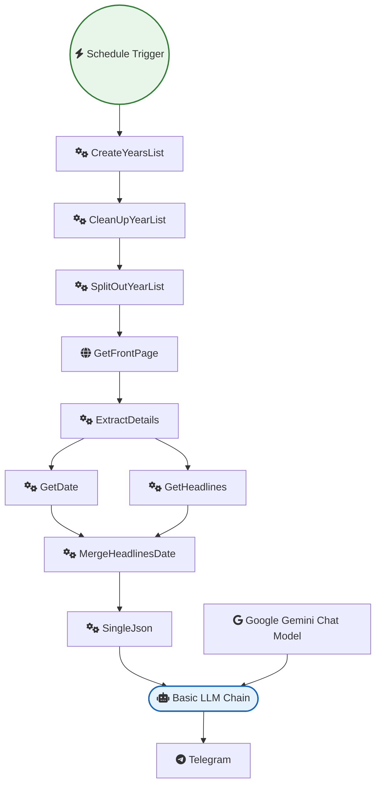

```mermaid
graph TD
    classDef trigger fill:#e8f5e9,stroke:#2e7d32,stroke-width:2px;
    classDef ai fill:#e3f2fd,stroke:#1565c0,stroke-width:2px;
    classDef logic fill:#fff3e0,stroke:#ef6c00,stroke-width:2px;

    Basic_LLM_Chain(["fas:fa-robot Basic LLM Chain"]):::ai
    Google_Gemini_Chat_Model["fab:fa-google Google Gemini Chat Model"]
    Schedule_Trigger(("fas:fa-bolt Schedule Trigger")):::trigger
    CreateYearsList["fas:fa-cogs CreateYearsList"]
    CleanUpYearList["fas:fa-cogs CleanUpYearList"]
    SplitOutYearList["fas:fa-cogs SplitOutYearList"]
    GetFrontPage["fas:fa-globe GetFrontPage"]
    ExtractDetails["fas:fa-cogs ExtractDetails"]
    GetHeadlines["fas:fa-cogs GetHeadlines"]
    GetDate["fas:fa-cogs GetDate"]
    MergeHeadlinesDate["fas:fa-cogs MergeHeadlinesDate"]
    SingleJson["fas:fa-cogs SingleJson"]
    Telegram["fab:fa-telegram Telegram"]

    GetDate --> MergeHeadlinesDate
    SingleJson --> Basic_LLM_Chain
    GetFrontPage --> ExtractDetails
    GetHeadlines --> MergeHeadlinesDate
    ExtractDetails --> GetHeadlines
    ExtractDetails --> GetDate
    Basic_LLM_Chain --> Telegram
    CleanUpYearList --> SplitOutYearList
    CreateYearsList --> CleanUpYearList
    Schedule_Trigger --> CreateYearsList
    SplitOutYearList --> GetFrontPage
    MergeHeadlinesDate --> SingleJson
    Google_Gemini_Chat_Model --> Basic_LLM_Chain
```
