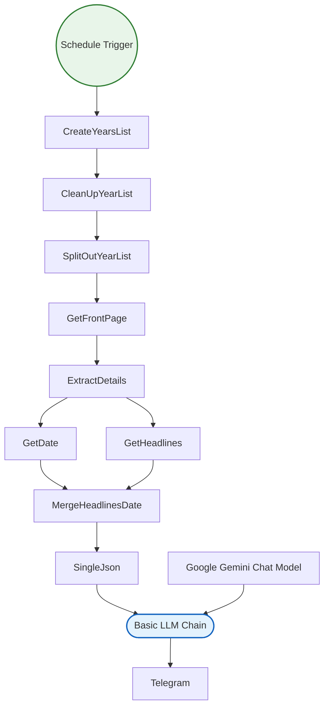

```mermaid
graph TD
    classDef trigger fill:#e8f5e9,stroke:#2e7d32,stroke-width:2px;
    classDef ai fill:#e3f2fd,stroke:#1565c0,stroke-width:2px;
    classDef logic fill:#fff3e0,stroke:#ef6c00,stroke-width:2px;

    Basic_LLM_Chain(["Basic LLM Chain"]):::ai
    Google_Gemini_Chat_Model["Google Gemini Chat Model"]
    Schedule_Trigger(("Schedule Trigger")):::trigger
    CreateYearsList["CreateYearsList"]
    CleanUpYearList["CleanUpYearList"]
    SplitOutYearList["SplitOutYearList"]
    GetFrontPage["GetFrontPage"]
    ExtractDetails["ExtractDetails"]
    GetHeadlines["GetHeadlines"]
    GetDate["GetDate"]
    MergeHeadlinesDate["MergeHeadlinesDate"]
    SingleJson["SingleJson"]
    Telegram["Telegram"]

    GetDate --> MergeHeadlinesDate
    SingleJson --> Basic_LLM_Chain
    GetFrontPage --> ExtractDetails
    GetHeadlines --> MergeHeadlinesDate
    ExtractDetails --> GetHeadlines
    ExtractDetails --> GetDate
    Basic_LLM_Chain --> Telegram
    CleanUpYearList --> SplitOutYearList
    CreateYearsList --> CleanUpYearList
    Schedule_Trigger --> CreateYearsList
    SplitOutYearList --> GetFrontPage
    MergeHeadlinesDate --> SingleJson
    Google_Gemini_Chat_Model --> Basic_LLM_Chain
```
