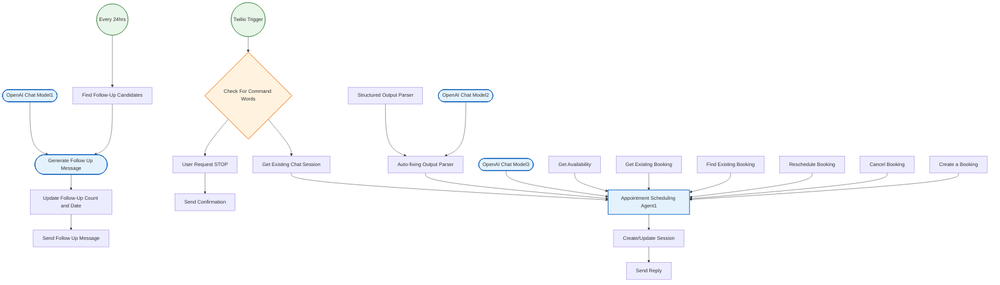

```mermaid
graph TD
    classDef trigger fill:#e8f5e9,stroke:#2e7d32,stroke-width:2px;
    classDef ai fill:#e3f2fd,stroke:#1565c0,stroke-width:2px;
    classDef logic fill:#fff3e0,stroke:#ef6c00,stroke-width:2px;

    Twilio_Trigger(("Twilio Trigger")):::trigger
    OpenAI_Chat_Model1(["OpenAI Chat Model1"]):::ai
    Find_Follow_Up_Candidates["Find Follow-Up Candidates"]
    Send_Follow_Up_Message["Send Follow Up Message"]
    Update_Follow_Up_Count_and_Date["Update Follow-Up Count and Date"]
    Create_Update_Session["Create/Update Session"]
    Get_Existing_Chat_Session["Get Existing Chat Session"]
    Every_24hrs(("Every 24hrs")):::trigger
    Send_Reply["Send Reply"]
    Send_Confirmation["Send Confirmation"]
    User_Request_STOP["User Request STOP"]
    Check_For_Command_Words{"Check For Command Words"}:::logic
    Structured_Output_Parser["Structured Output Parser"]
    Auto_fixing_Output_Parser["Auto-fixing Output Parser"]
    OpenAI_Chat_Model2(["OpenAI Chat Model2"]):::ai
    Generate_Follow_Up_Message(["Generate Follow Up Message"]):::ai
    OpenAI_Chat_Model3(["OpenAI Chat Model3"]):::ai
    Get_Availability["Get Availability"]
    Get_Existing_Booking["Get Existing Booking"]
    Find_Existing_Booking["Find Existing Booking"]
    Reschedule_Booking["Reschedule Booking"]
    Cancel_Booking["Cancel Booking"]
    Create_a_Booking["Create a Booking"]
    Appointment_Scheduling_Agent1["Appointment Scheduling Agent1"]:::ai

    Every_24hrs --> Find_Follow_Up_Candidates
    Cancel_Booking --> Appointment_Scheduling_Agent1
    Twilio_Trigger --> Check_For_Command_Words
    Create_a_Booking --> Appointment_Scheduling_Agent1
    Get_Availability --> Appointment_Scheduling_Agent1
    User_Request_STOP --> Send_Confirmation
    OpenAI_Chat_Model1 --> Generate_Follow_Up_Message
    OpenAI_Chat_Model2 --> Auto_fixing_Output_Parser
    OpenAI_Chat_Model3 --> Appointment_Scheduling_Agent1
    Reschedule_Booking --> Appointment_Scheduling_Agent1
    Get_Existing_Booking --> Appointment_Scheduling_Agent1
    Create_Update_Session --> Send_Reply
    Find_Existing_Booking --> Appointment_Scheduling_Agent1
    Check_For_Command_Words --> User_Request_STOP
    Check_For_Command_Words --> Get_Existing_Chat_Session
    Structured_Output_Parser --> Auto_fixing_Output_Parser
    Auto_fixing_Output_Parser --> Appointment_Scheduling_Agent1
    Find_Follow_Up_Candidates --> Generate_Follow_Up_Message
    Get_Existing_Chat_Session --> Appointment_Scheduling_Agent1
    Generate_Follow_Up_Message --> Update_Follow_Up_Count_and_Date
    Appointment_Scheduling_Agent1 --> Create_Update_Session
    Update_Follow_Up_Count_and_Date --> Send_Follow_Up_Message
```
