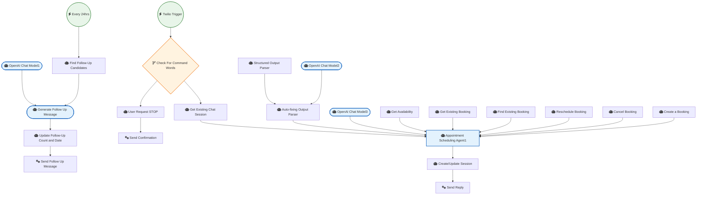

```mermaid
graph TD
    classDef trigger fill:#e8f5e9,stroke:#2e7d32,stroke-width:2px;
    classDef ai fill:#e3f2fd,stroke:#1565c0,stroke-width:2px;
    classDef logic fill:#fff3e0,stroke:#ef6c00,stroke-width:2px;

    Twilio_Trigger(("fas:fa-bolt Twilio Trigger")):::trigger
    OpenAI_Chat_Model1(["fas:fa-robot OpenAI Chat Model1"]):::ai
    Find_Follow_Up_Candidates["fas:fa-robot Find Follow-Up Candidates"]
    Send_Follow_Up_Message["fas:fa-cogs Send Follow Up Message"]
    Update_Follow_Up_Count_and_Date["fas:fa-robot Update Follow-Up Count and Date"]
    Create_Update_Session["fas:fa-robot Create/Update Session"]
    Get_Existing_Chat_Session["fas:fa-robot Get Existing Chat Session"]
    Every_24hrs(("fas:fa-bolt Every 24hrs")):::trigger
    Send_Reply["fas:fa-cogs Send Reply"]
    Send_Confirmation["fas:fa-cogs Send Confirmation"]
    User_Request_STOP["fas:fa-robot User Request STOP"]
    Check_For_Command_Words{"fas:fa-code-branch Check For Command Words"}:::logic
    Structured_Output_Parser["fas:fa-robot Structured Output Parser"]
    Auto_fixing_Output_Parser["fas:fa-robot Auto-fixing Output Parser"]
    OpenAI_Chat_Model2(["fas:fa-robot OpenAI Chat Model2"]):::ai
    Generate_Follow_Up_Message(["fas:fa-robot Generate Follow Up Message"]):::ai
    OpenAI_Chat_Model3(["fas:fa-robot OpenAI Chat Model3"]):::ai
    Get_Availability["fas:fa-robot Get Availability"]
    Get_Existing_Booking["fas:fa-robot Get Existing Booking"]
    Find_Existing_Booking["fas:fa-robot Find Existing Booking"]
    Reschedule_Booking["fas:fa-robot Reschedule Booking"]
    Cancel_Booking["fas:fa-robot Cancel Booking"]
    Create_a_Booking["fas:fa-robot Create a Booking"]
    Appointment_Scheduling_Agent1["fas:fa-robot Appointment Scheduling Agent1"]:::ai

    Every_24hrs --> Find_Follow_Up_Candidates
    Cancel_Booking --> Appointment_Scheduling_Agent1
    Twilio_Trigger --> Check_For_Command_Words
    Create_a_Booking --> Appointment_Scheduling_Agent1
    Get_Availability --> Appointment_Scheduling_Agent1
    User_Request_STOP --> Send_Confirmation
    OpenAI_Chat_Model1 --> Generate_Follow_Up_Message
    OpenAI_Chat_Model2 --> Auto_fixing_Output_Parser
    OpenAI_Chat_Model3 --> Appointment_Scheduling_Agent1
    Reschedule_Booking --> Appointment_Scheduling_Agent1
    Get_Existing_Booking --> Appointment_Scheduling_Agent1
    Create_Update_Session --> Send_Reply
    Find_Existing_Booking --> Appointment_Scheduling_Agent1
    Check_For_Command_Words --> User_Request_STOP
    Check_For_Command_Words --> Get_Existing_Chat_Session
    Structured_Output_Parser --> Auto_fixing_Output_Parser
    Auto_fixing_Output_Parser --> Appointment_Scheduling_Agent1
    Find_Follow_Up_Candidates --> Generate_Follow_Up_Message
    Get_Existing_Chat_Session --> Appointment_Scheduling_Agent1
    Generate_Follow_Up_Message --> Update_Follow_Up_Count_and_Date
    Appointment_Scheduling_Agent1 --> Create_Update_Session
    Update_Follow_Up_Count_and_Date --> Send_Follow_Up_Message
```
