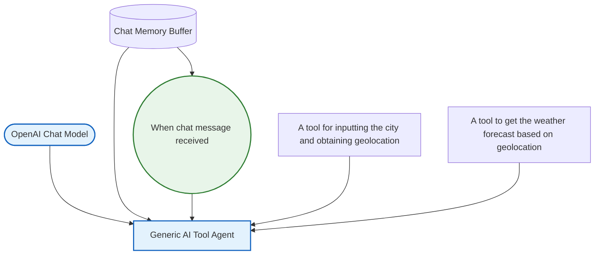

```mermaid
graph TD
    classDef trigger fill:#e8f5e9,stroke:#2e7d32,stroke-width:2px;
    classDef ai fill:#e3f2fd,stroke:#1565c0,stroke-width:2px;
    classDef logic fill:#fff3e0,stroke:#ef6c00,stroke-width:2px;

    When_chat_message_received(("When chat message received")):::trigger
    OpenAI_Chat_Model(["OpenAI Chat Model"]):::ai
    Generic_AI_Tool_Agent["Generic AI Tool Agent"]:::ai
    Chat_Memory_Buffer[("Chat Memory Buffer")]
    A_tool_to_get_the_weather_forecast_based_on_geolocation["A tool to get the weather forecast based on geolocation"]
    A_tool_for_inputting_the_city_and_obtaining_geolocation["A tool for inputting the city and obtaining geolocation"]

    OpenAI_Chat_Model --> Generic_AI_Tool_Agent
    Chat_Memory_Buffer --> When_chat_message_received
    Chat_Memory_Buffer --> Generic_AI_Tool_Agent
    When_chat_message_received --> Generic_AI_Tool_Agent
    A_tool_for_inputting_the_city_and_obtaining_geolocation --> Generic_AI_Tool_Agent
    A_tool_to_get_the_weather_forecast_based_on_geolocation --> Generic_AI_Tool_Agent
```
