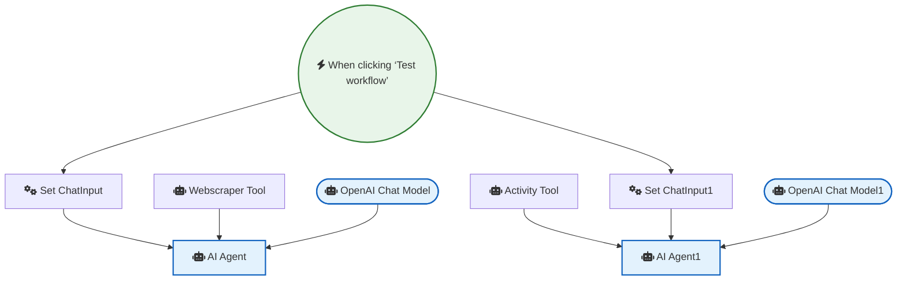

```mermaid
graph TD
    classDef trigger fill:#e8f5e9,stroke:#2e7d32,stroke-width:2px;
    classDef ai fill:#e3f2fd,stroke:#1565c0,stroke-width:2px;
    classDef logic fill:#fff3e0,stroke:#ef6c00,stroke-width:2px;

    OpenAI_Chat_Model(["fas:fa-robot OpenAI Chat Model"]):::ai
    OpenAI_Chat_Model1(["fas:fa-robot OpenAI Chat Model1"]):::ai
    Activity_Tool["fas:fa-robot Activity Tool"]
    Set_ChatInput1["fas:fa-cogs Set ChatInput1"]
    AI_Agent1["fas:fa-robot AI Agent1"]:::ai
    Set_ChatInput["fas:fa-cogs Set ChatInput"]
    When_clicking__Test_workflow_(("fas:fa-bolt When clicking ‘Test workflow’")):::trigger
    AI_Agent["fas:fa-robot AI Agent"]:::ai
    Webscraper_Tool["fas:fa-robot Webscraper Tool"]

    Activity_Tool --> AI_Agent1
    Set_ChatInput --> AI_Agent
    Set_ChatInput1 --> AI_Agent1
    Webscraper_Tool --> AI_Agent
    OpenAI_Chat_Model --> AI_Agent
    OpenAI_Chat_Model1 --> AI_Agent1
    When_clicking__Test_workflow_ --> Set_ChatInput
    When_clicking__Test_workflow_ --> Set_ChatInput1
```
