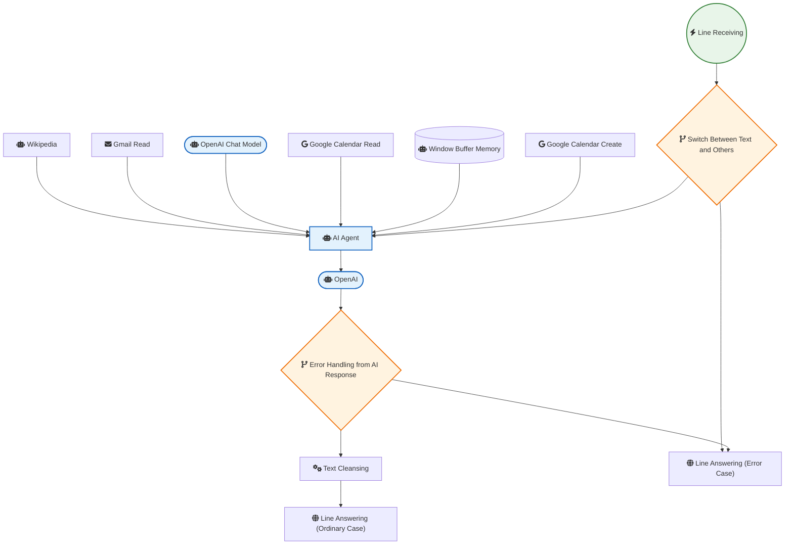

```mermaid
graph TD
    classDef trigger fill:#e8f5e9,stroke:#2e7d32,stroke-width:2px;
    classDef ai fill:#e3f2fd,stroke:#1565c0,stroke-width:2px;
    classDef logic fill:#fff3e0,stroke:#ef6c00,stroke-width:2px;

    AI_Agent["fas:fa-robot AI Agent"]:::ai
    Window_Buffer_Memory[("fas:fa-robot Window Buffer Memory")]
    OpenAI_Chat_Model(["fas:fa-robot OpenAI Chat Model"]):::ai
    Wikipedia["fas:fa-robot Wikipedia"]
    OpenAI(["fas:fa-robot OpenAI"]):::ai
    Switch_Between_Text_and_Others{"fas:fa-code-branch Switch Between Text and Others"}:::logic
    Line_Receiving(("fas:fa-bolt Line Receiving")):::trigger
    Error_Handling_from_AI_Response{"fas:fa-code-branch Error Handling from AI Response"}:::logic
    Text_Cleansing["fas:fa-cogs Text Cleansing"]
    Line_Answering__Error_Case_["fas:fa-globe Line Answering (Error Case)"]
    Line_Answering__Ordinary_Case_["fas:fa-globe Line Answering (Ordinary Case)"]
    Google_Calendar_Create["fab:fa-google Google Calendar Create"]
    Google_Calendar_Read["fab:fa-google Google Calendar Read"]
    Gmail_Read["fas:fa-envelope Gmail Read"]

    OpenAI --> Error_Handling_from_AI_Response
    AI_Agent --> OpenAI
    Wikipedia --> AI_Agent
    Gmail_Read --> AI_Agent
    Line_Receiving --> Switch_Between_Text_and_Others
    Text_Cleansing --> Line_Answering__Ordinary_Case_
    OpenAI_Chat_Model --> AI_Agent
    Google_Calendar_Read --> AI_Agent
    Window_Buffer_Memory --> AI_Agent
    Google_Calendar_Create --> AI_Agent
    Switch_Between_Text_and_Others --> AI_Agent
    Switch_Between_Text_and_Others --> Line_Answering__Error_Case_
    Error_Handling_from_AI_Response --> Text_Cleansing
    Error_Handling_from_AI_Response --> Line_Answering__Error_Case_
```
