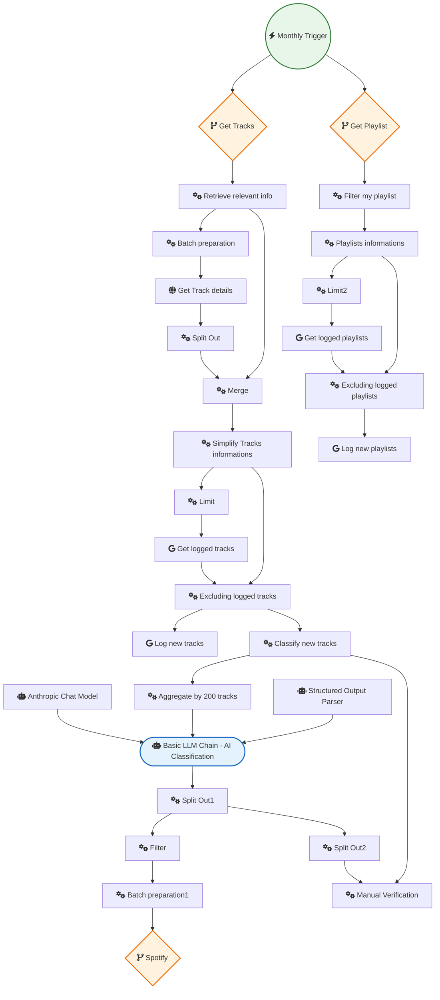

```mermaid
graph TD
    classDef trigger fill:#e8f5e9,stroke:#2e7d32,stroke-width:2px;
    classDef ai fill:#e3f2fd,stroke:#1565c0,stroke-width:2px;
    classDef logic fill:#fff3e0,stroke:#ef6c00,stroke-width:2px;

    Retrieve_relevant_info["fas:fa-cogs Retrieve relevant info"]
    Batch_preparation["fas:fa-cogs Batch preparation"]
    Get_Track_details["fas:fa-globe Get Track details"]
    Split_Out["fas:fa-cogs Split Out"]
    Anthropic_Chat_Model["fas:fa-robot Anthropic Chat Model"]
    Get_Playlist{"fas:fa-code-branch Get Playlist"}:::logic
    Get_Tracks{"fas:fa-code-branch Get Tracks"}:::logic
    Structured_Output_Parser["fas:fa-robot Structured Output Parser"]
    Playlists_informations["fas:fa-cogs Playlists informations"]
    Filter_my_playlist["fas:fa-cogs Filter my playlist"]
    Split_Out1["fas:fa-cogs Split Out1"]
    Batch_preparation1["fas:fa-cogs Batch preparation1"]
    Merge["fas:fa-cogs Merge"]
    Simplify_Tracks_informations["fas:fa-cogs Simplify Tracks informations"]
    Limit["fas:fa-cogs Limit"]
    Get_logged_tracks["fab:fa-google Get logged tracks"]
    Excluding_logged_tracks["fas:fa-cogs Excluding logged tracks"]
    Filter["fas:fa-cogs Filter"]
    Split_Out2["fas:fa-cogs Split Out2"]
    Manual_Verification["fas:fa-cogs Manual Verification"]
    Spotify{"fas:fa-code-branch Spotify"}:::logic
    Aggregate_by_200_tracks["fas:fa-cogs Aggregate by 200 tracks"]
    Monthly_Trigger(("fas:fa-bolt Monthly Trigger")):::trigger
    Get_logged_playlists["fab:fa-google Get logged playlists"]
    Log_new_tracks["fab:fa-google Log new tracks"]
    Log_new_playlists["fab:fa-google Log new playlists"]
    Excluding_logged_playlists["fas:fa-cogs Excluding logged playlists"]
    Limit2["fas:fa-cogs Limit2"]
    Classify_new_tracks["fas:fa-cogs Classify new tracks"]
    Basic_LLM_Chain___AI_Classification(["fas:fa-robot Basic LLM Chain - AI Classification"]):::ai

    Limit --> Get_logged_tracks
    Merge --> Simplify_Tracks_informations
    Filter --> Batch_preparation1
    Limit2 --> Get_logged_playlists
    Split_Out --> Merge
    Get_Tracks --> Retrieve_relevant_info
    Split_Out1 --> Split_Out2
    Split_Out1 --> Filter
    Split_Out2 --> Manual_Verification
    Get_Playlist --> Filter_my_playlist
    Monthly_Trigger --> Get_Playlist
    Monthly_Trigger --> Get_Tracks
    Batch_preparation --> Get_Track_details
    Get_Track_details --> Split_Out
    Get_logged_tracks --> Excluding_logged_tracks
    Batch_preparation1 --> Spotify
    Filter_my_playlist --> Playlists_informations
    Classify_new_tracks --> Aggregate_by_200_tracks
    Classify_new_tracks --> Manual_Verification
    Anthropic_Chat_Model --> Basic_LLM_Chain___AI_Classification
    Get_logged_playlists --> Excluding_logged_playlists
    Playlists_informations --> Excluding_logged_playlists
    Playlists_informations --> Limit2
    Retrieve_relevant_info --> Batch_preparation
    Retrieve_relevant_info --> Merge
    Aggregate_by_200_tracks --> Basic_LLM_Chain___AI_Classification
    Excluding_logged_tracks --> Log_new_tracks
    Excluding_logged_tracks --> Classify_new_tracks
    Structured_Output_Parser --> Basic_LLM_Chain___AI_Classification
    Excluding_logged_playlists --> Log_new_playlists
    Simplify_Tracks_informations --> Limit
    Simplify_Tracks_informations --> Excluding_logged_tracks
    Basic_LLM_Chain___AI_Classification --> Split_Out1
```
