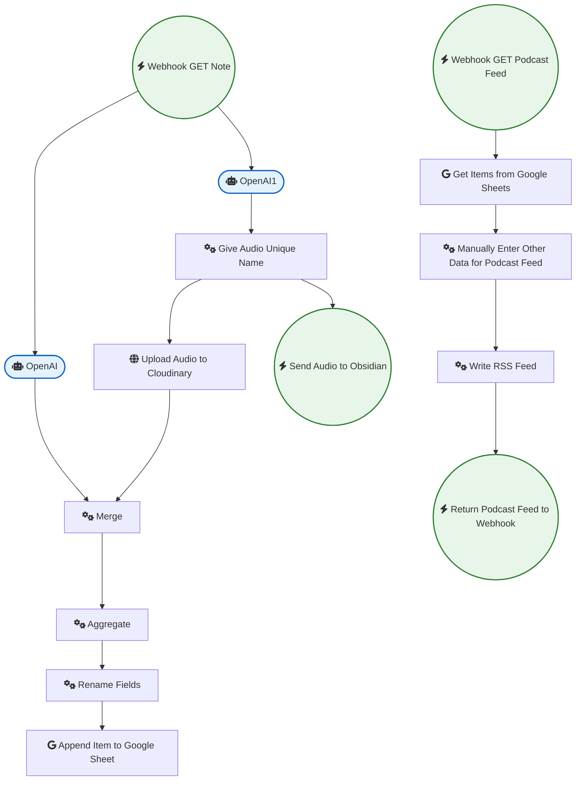

```mermaid
graph TD
    classDef trigger fill:#e8f5e9,stroke:#2e7d32,stroke-width:2px;
    classDef ai fill:#e3f2fd,stroke:#1565c0,stroke-width:2px;
    classDef logic fill:#fff3e0,stroke:#ef6c00,stroke-width:2px;

    OpenAI1(["fas:fa-robot OpenAI1"]):::ai
    Webhook_GET_Note(("fas:fa-bolt Webhook GET Note")):::trigger
    Webhook_GET_Podcast_Feed(("fas:fa-bolt Webhook GET Podcast Feed")):::trigger
    Upload_Audio_to_Cloudinary["fas:fa-globe Upload Audio to Cloudinary"]
    OpenAI(["fas:fa-robot OpenAI"]):::ai
    Merge["fas:fa-cogs Merge"]
    Aggregate["fas:fa-cogs Aggregate"]
    Give_Audio_Unique_Name["fas:fa-cogs Give Audio Unique Name"]
    Send_Audio_to_Obsidian(("fas:fa-bolt Send Audio to Obsidian")):::trigger
    Rename_Fields["fas:fa-cogs Rename Fields"]
    Append_Item_to_Google_Sheet["fab:fa-google Append Item to Google Sheet"]
    Get_Items_from_Google_Sheets["fab:fa-google Get Items from Google Sheets"]
    Write_RSS_Feed["fas:fa-cogs Write RSS Feed"]
    Return_Podcast_Feed_to_Webhook(("fas:fa-bolt Return Podcast Feed to Webhook")):::trigger
    Manually_Enter_Other_Data_for_Podcast_Feed["fas:fa-cogs Manually Enter Other Data for Podcast Feed"]

    Merge --> Aggregate
    OpenAI --> Merge
    OpenAI1 --> Give_Audio_Unique_Name
    Aggregate --> Rename_Fields
    Rename_Fields --> Append_Item_to_Google_Sheet
    Write_RSS_Feed --> Return_Podcast_Feed_to_Webhook
    Webhook_GET_Note --> OpenAI1
    Webhook_GET_Note --> OpenAI
    Give_Audio_Unique_Name --> Upload_Audio_to_Cloudinary
    Give_Audio_Unique_Name --> Send_Audio_to_Obsidian
    Webhook_GET_Podcast_Feed --> Get_Items_from_Google_Sheets
    Upload_Audio_to_Cloudinary --> Merge
    Get_Items_from_Google_Sheets --> Manually_Enter_Other_Data_for_Podcast_Feed
    Manually_Enter_Other_Data_for_Podcast_Feed --> Write_RSS_Feed
```
