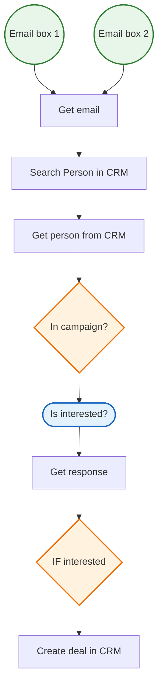

```mermaid
graph TD
    classDef trigger fill:#e8f5e9,stroke:#2e7d32,stroke-width:2px;
    classDef ai fill:#e3f2fd,stroke:#1565c0,stroke-width:2px;
    classDef logic fill:#fff3e0,stroke:#ef6c00,stroke-width:2px;

    Search_Person_in_CRM["Search Person in CRM"]
    In_campaign_{"In campaign?"}:::logic
    Get_person_from_CRM["Get person from CRM"]
    Is_interested_(["Is interested?"]):::ai
    Get_email["Get email"]
    Create_deal_in_CRM["Create deal in CRM"]
    IF_interested{"IF interested"}:::logic
    Get_response["Get response"]
    Email_box_1(("Email box 1")):::trigger
    Email_box_2(("Email box 2")):::trigger

    Get_email --> Search_Person_in_CRM
    Email_box_1 --> Get_email
    Email_box_2 --> Get_email
    Get_response --> IF_interested
    In_campaign_ --> Is_interested_
    IF_interested --> Create_deal_in_CRM
    Is_interested_ --> Get_response
    Get_person_from_CRM --> In_campaign_
    Search_Person_in_CRM --> Get_person_from_CRM
```
