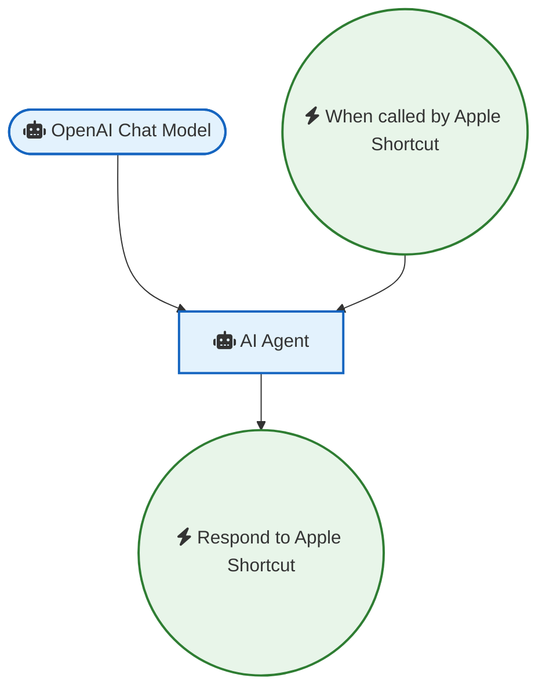

```mermaid
graph TD
    classDef trigger fill:#e8f5e9,stroke:#2e7d32,stroke-width:2px;
    classDef ai fill:#e3f2fd,stroke:#1565c0,stroke-width:2px;
    classDef logic fill:#fff3e0,stroke:#ef6c00,stroke-width:2px;

    OpenAI_Chat_Model(["fas:fa-robot OpenAI Chat Model"]):::ai
    Respond_to_Apple_Shortcut(("fas:fa-bolt Respond to Apple Shortcut")):::trigger
    AI_Agent["fas:fa-robot AI Agent"]:::ai
    When_called_by_Apple_Shortcut(("fas:fa-bolt When called by Apple Shortcut")):::trigger

    AI_Agent --> Respond_to_Apple_Shortcut
    OpenAI_Chat_Model --> AI_Agent
    When_called_by_Apple_Shortcut --> AI_Agent
```
