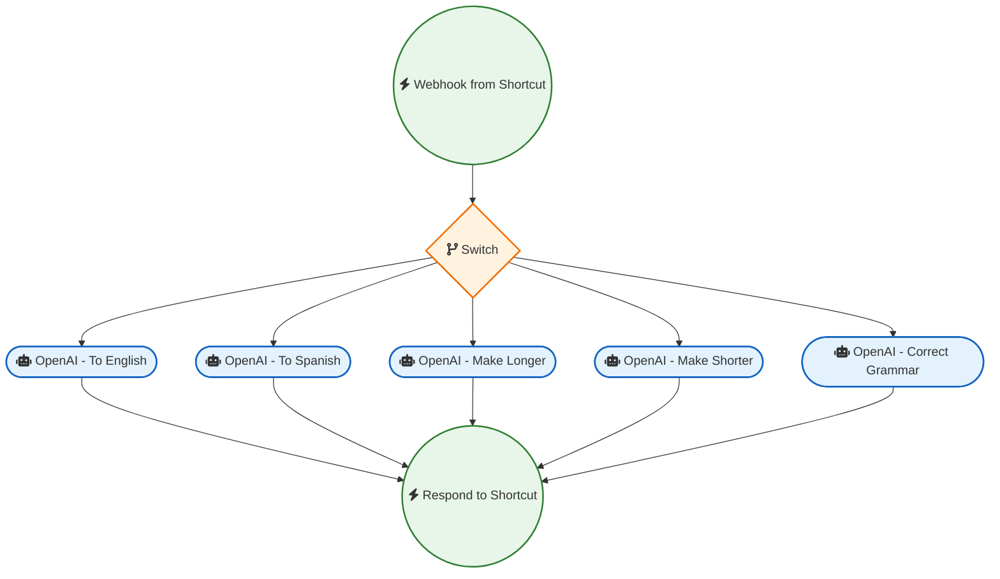

```mermaid
graph TD
    classDef trigger fill:#e8f5e9,stroke:#2e7d32,stroke-width:2px;
    classDef ai fill:#e3f2fd,stroke:#1565c0,stroke-width:2px;
    classDef logic fill:#fff3e0,stroke:#ef6c00,stroke-width:2px;

    Switch{"fas:fa-code-branch Switch"}:::logic
    Respond_to_Shortcut(("fas:fa-bolt Respond to Shortcut")):::trigger
    Webhook_from_Shortcut(("fas:fa-bolt Webhook from Shortcut")):::trigger
    OpenAI___Make_Shorter(["fas:fa-robot OpenAI - Make Shorter"]):::ai
    OpenAI___Make_Longer(["fas:fa-robot OpenAI - Make Longer"]):::ai
    OpenAI___Correct_Grammar(["fas:fa-robot OpenAI - Correct Grammar"]):::ai
    OpenAI___To_Spanish(["fas:fa-robot OpenAI - To Spanish"]):::ai
    OpenAI___To_English(["fas:fa-robot OpenAI - To English"]):::ai

    Switch --> OpenAI___To_Spanish
    Switch --> OpenAI___To_English
    Switch --> OpenAI___Correct_Grammar
    Switch --> OpenAI___Make_Shorter
    Switch --> OpenAI___Make_Longer
    OpenAI___To_English --> Respond_to_Shortcut
    OpenAI___To_Spanish --> Respond_to_Shortcut
    OpenAI___Make_Longer --> Respond_to_Shortcut
    OpenAI___Make_Shorter --> Respond_to_Shortcut
    Webhook_from_Shortcut --> Switch
    OpenAI___Correct_Grammar --> Respond_to_Shortcut
```
