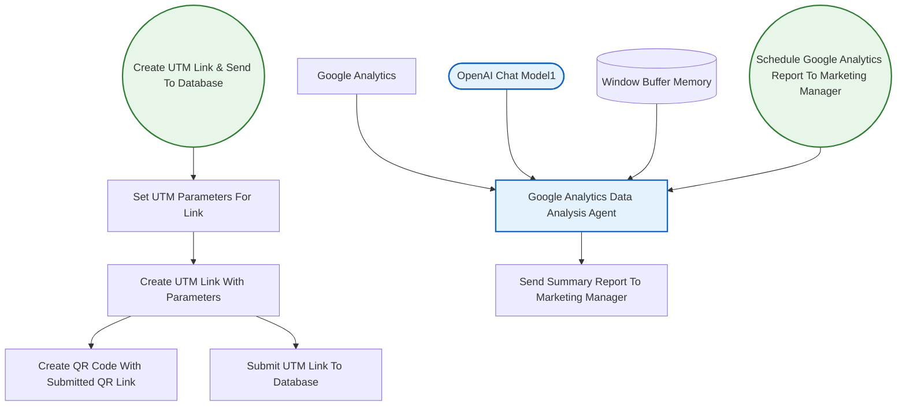

```mermaid
graph TD
    classDef trigger fill:#e8f5e9,stroke:#2e7d32,stroke-width:2px;
    classDef ai fill:#e3f2fd,stroke:#1565c0,stroke-width:2px;
    classDef logic fill:#fff3e0,stroke:#ef6c00,stroke-width:2px;

    OpenAI_Chat_Model1(["OpenAI Chat Model1"]):::ai
    Window_Buffer_Memory[("Window Buffer Memory")]
    Google_Analytics["Google Analytics"]
    Create_UTM_Link___Send_To_Database(("Create UTM Link & Send To Database")):::trigger
    Set_UTM_Parameters_For_Link["Set UTM Parameters For Link"]
    Create_UTM_Link_With_Parameters["Create UTM Link With Parameters"]
    Submit_UTM_Link_To_Database["Submit UTM Link To Database"]
    Create_QR_Code_With_Submitted_QR_Link["Create QR Code With Submitted QR Link"]
    Schedule_Google_Analytics_Report_To_Marketing_Manager(("Schedule Google Analytics Report To Marketing Manager")):::trigger
    Google_Analytics_Data_Analysis_Agent["Google Analytics Data Analysis Agent"]:::ai
    Send_Summary_Report_To_Marketing_Manager["Send Summary Report To Marketing Manager"]

    Google_Analytics --> Google_Analytics_Data_Analysis_Agent
    OpenAI_Chat_Model1 --> Google_Analytics_Data_Analysis_Agent
    Window_Buffer_Memory --> Google_Analytics_Data_Analysis_Agent
    Set_UTM_Parameters_For_Link --> Create_UTM_Link_With_Parameters
    Create_UTM_Link_With_Parameters --> Create_QR_Code_With_Submitted_QR_Link
    Create_UTM_Link_With_Parameters --> Submit_UTM_Link_To_Database
    Create_UTM_Link___Send_To_Database --> Set_UTM_Parameters_For_Link
    Google_Analytics_Data_Analysis_Agent --> Send_Summary_Report_To_Marketing_Manager
    Schedule_Google_Analytics_Report_To_Marketing_Manager --> Google_Analytics_Data_Analysis_Agent
```
