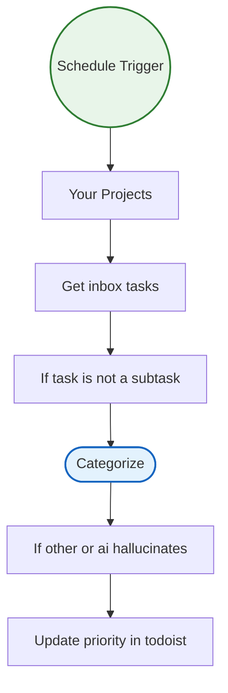

```mermaid
graph TD
    classDef trigger fill:#e8f5e9,stroke:#2e7d32,stroke-width:2px;
    classDef ai fill:#e3f2fd,stroke:#1565c0,stroke-width:2px;
    classDef logic fill:#fff3e0,stroke:#ef6c00,stroke-width:2px;

    Update_priority_in_todoist["Update priority in todoist"]
    Schedule_Trigger(("Schedule Trigger")):::trigger
    Get_inbox_tasks["Get inbox tasks"]
    Your_Projects["Your Projects"]
    Categorize(["Categorize"]):::ai
    If_task_is_not_a_subtask["If task is not a subtask"]
    If_other_or_ai_hallucinates["If other or ai hallucinates"]

    Categorize --> If_other_or_ai_hallucinates
    Your_Projects --> Get_inbox_tasks
    Get_inbox_tasks --> If_task_is_not_a_subtask
    Schedule_Trigger --> Your_Projects
    If_task_is_not_a_subtask --> Categorize
    If_other_or_ai_hallucinates --> Update_priority_in_todoist
```
