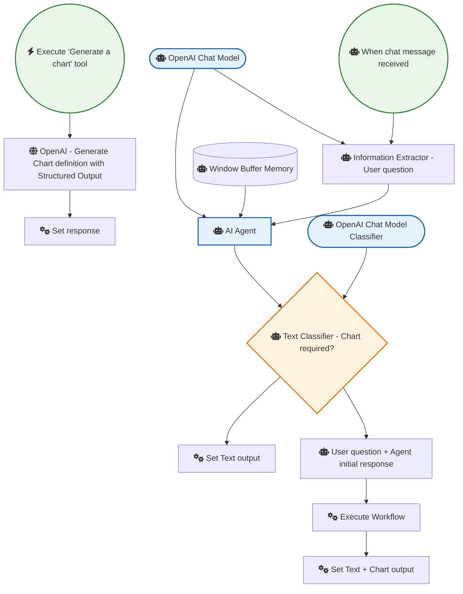

```mermaid
graph TD
    classDef trigger fill:#e8f5e9,stroke:#2e7d32,stroke-width:2px;
    classDef ai fill:#e3f2fd,stroke:#1565c0,stroke-width:2px;
    classDef logic fill:#fff3e0,stroke:#ef6c00,stroke-width:2px;

    OpenAI_Chat_Model(["fas:fa-robot OpenAI Chat Model"]):::ai
    Execute_Workflow["fas:fa-cogs Execute Workflow"]
    Execute__Generate_a_chart__tool(("fas:fa-bolt Execute 'Generate a chart' tool")):::trigger
    OpenAI___Generate_Chart_definition_with_Structured_Output["fas:fa-globe OpenAI - Generate Chart definition with Structured Output"]
    Set_response["fas:fa-cogs Set response"]
    When_chat_message_received(("fas:fa-robot When chat message received")):::trigger
    Set_Text_output["fas:fa-cogs Set Text output"]
    Set_Text___Chart_output["fas:fa-cogs Set Text + Chart output"]
    AI_Agent["fas:fa-robot AI Agent"]:::ai
    Window_Buffer_Memory[("fas:fa-robot Window Buffer Memory")]
    OpenAI_Chat_Model_Classifier(["fas:fa-robot OpenAI Chat Model Classifier"]):::ai
    Text_Classifier___Chart_required_{"fas:fa-robot Text Classifier - Chart required?"}:::logic
    User_question___Agent_initial_response["fas:fa-robot User question + Agent initial response"]
    Information_Extractor___User_question["fas:fa-robot Information Extractor - User question"]

    AI_Agent --> Text_Classifier___Chart_required_
    Execute_Workflow --> Set_Text___Chart_output
    OpenAI_Chat_Model --> AI_Agent
    OpenAI_Chat_Model --> Information_Extractor___User_question
    Window_Buffer_Memory --> AI_Agent
    When_chat_message_received --> Information_Extractor___User_question
    OpenAI_Chat_Model_Classifier --> Text_Classifier___Chart_required_
    Execute__Generate_a_chart__tool --> OpenAI___Generate_Chart_definition_with_Structured_Output
    Text_Classifier___Chart_required_ --> User_question___Agent_initial_response
    Text_Classifier___Chart_required_ --> Set_Text_output
    Information_Extractor___User_question --> AI_Agent
    User_question___Agent_initial_response --> Execute_Workflow
    OpenAI___Generate_Chart_definition_with_Structured_Output --> Set_response
```
