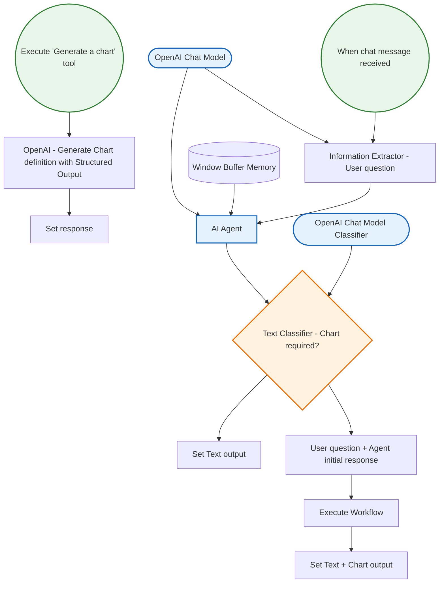

```mermaid
graph TD
    classDef trigger fill:#e8f5e9,stroke:#2e7d32,stroke-width:2px;
    classDef ai fill:#e3f2fd,stroke:#1565c0,stroke-width:2px;
    classDef logic fill:#fff3e0,stroke:#ef6c00,stroke-width:2px;

    OpenAI_Chat_Model(["OpenAI Chat Model"]):::ai
    Execute_Workflow["Execute Workflow"]
    Execute__Generate_a_chart__tool(("Execute 'Generate a chart' tool")):::trigger
    OpenAI___Generate_Chart_definition_with_Structured_Output["OpenAI - Generate Chart definition with Structured Output"]
    Set_response["Set response"]
    When_chat_message_received(("When chat message received")):::trigger
    Set_Text_output["Set Text output"]
    Set_Text___Chart_output["Set Text + Chart output"]
    AI_Agent["AI Agent"]:::ai
    Window_Buffer_Memory[("Window Buffer Memory")]
    OpenAI_Chat_Model_Classifier(["OpenAI Chat Model Classifier"]):::ai
    Text_Classifier___Chart_required_{"Text Classifier - Chart required?"}:::logic
    User_question___Agent_initial_response["User question + Agent initial response"]
    Information_Extractor___User_question["Information Extractor - User question"]

    AI_Agent --> Text_Classifier___Chart_required_
    Execute_Workflow --> Set_Text___Chart_output
    OpenAI_Chat_Model --> AI_Agent
    OpenAI_Chat_Model --> Information_Extractor___User_question
    Window_Buffer_Memory --> AI_Agent
    When_chat_message_received --> Information_Extractor___User_question
    OpenAI_Chat_Model_Classifier --> Text_Classifier___Chart_required_
    Execute__Generate_a_chart__tool --> OpenAI___Generate_Chart_definition_with_Structured_Output
    Text_Classifier___Chart_required_ --> User_question___Agent_initial_response
    Text_Classifier___Chart_required_ --> Set_Text_output
    Information_Extractor___User_question --> AI_Agent
    User_question___Agent_initial_response --> Execute_Workflow
    OpenAI___Generate_Chart_definition_with_Structured_Output --> Set_response
```
