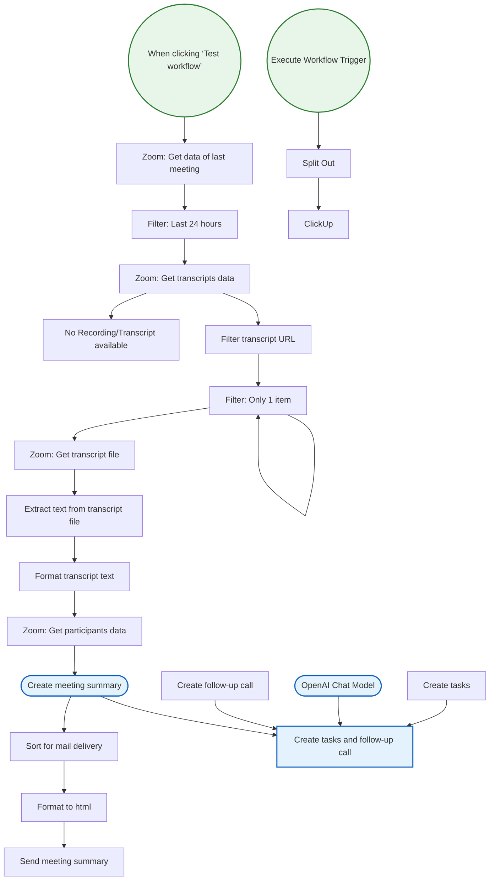

```mermaid
graph TD
    classDef trigger fill:#e8f5e9,stroke:#2e7d32,stroke-width:2px;
    classDef ai fill:#e3f2fd,stroke:#1565c0,stroke-width:2px;
    classDef logic fill:#fff3e0,stroke:#ef6c00,stroke-width:2px;

    OpenAI_Chat_Model(["OpenAI Chat Model"]):::ai
    When_clicking__Test_workflow_(("When clicking ‘Test workflow’")):::trigger
    No_Recording_Transcript_available["No Recording/Transcript available"]
    Zoom__Get_data_of_last_meeting["Zoom: Get data of last meeting"]
    Filter_transcript_URL["Filter transcript URL"]
    Filter__Only_1_item["Filter: Only 1 item"]
    Zoom__Get_transcript_file["Zoom: Get transcript file"]
    Extract_text_from_transcript_file["Extract text from transcript file"]
    Format_transcript_text["Format transcript text"]
    Zoom__Get_participants_data["Zoom: Get participants data"]
    Create_meeting_summary(["Create meeting summary"]):::ai
    Sort_for_mail_delivery["Sort for mail delivery"]
    Format_to_html["Format to html"]
    Send_meeting_summary["Send meeting summary"]
    Create_tasks["Create tasks"]
    Create_tasks_and_follow_up_call["Create tasks and follow-up call"]:::ai
    Create_follow_up_call["Create follow-up call"]
    Filter__Last_24_hours["Filter: Last 24 hours"]
    Execute_Workflow_Trigger(("Execute Workflow Trigger")):::trigger
    Split_Out["Split Out"]
    ClickUp["ClickUp"]
    Zoom__Get_transcripts_data["Zoom: Get transcripts data"]

    Split_Out --> ClickUp
    Create_tasks --> Create_tasks_and_follow_up_call
    Format_to_html --> Send_meeting_summary
    OpenAI_Chat_Model --> Create_tasks_and_follow_up_call
    Filter__Only_1_item --> Filter__Only_1_item
    Filter__Only_1_item --> Zoom__Get_transcript_file
    Create_follow_up_call --> Create_tasks_and_follow_up_call
    Filter_transcript_URL --> Filter__Only_1_item
    Filter__Last_24_hours --> Zoom__Get_transcripts_data
    Create_meeting_summary --> Sort_for_mail_delivery
    Create_meeting_summary --> Create_tasks_and_follow_up_call
    Format_transcript_text --> Zoom__Get_participants_data
    Sort_for_mail_delivery --> Format_to_html
    Execute_Workflow_Trigger --> Split_Out
    Zoom__Get_transcript_file --> Extract_text_from_transcript_file
    Zoom__Get_transcripts_data --> Filter_transcript_URL
    Zoom__Get_transcripts_data --> No_Recording_Transcript_available
    Zoom__Get_participants_data --> Create_meeting_summary
    Zoom__Get_data_of_last_meeting --> Filter__Last_24_hours
    Extract_text_from_transcript_file --> Format_transcript_text
    When_clicking__Test_workflow_ --> Zoom__Get_data_of_last_meeting
```
