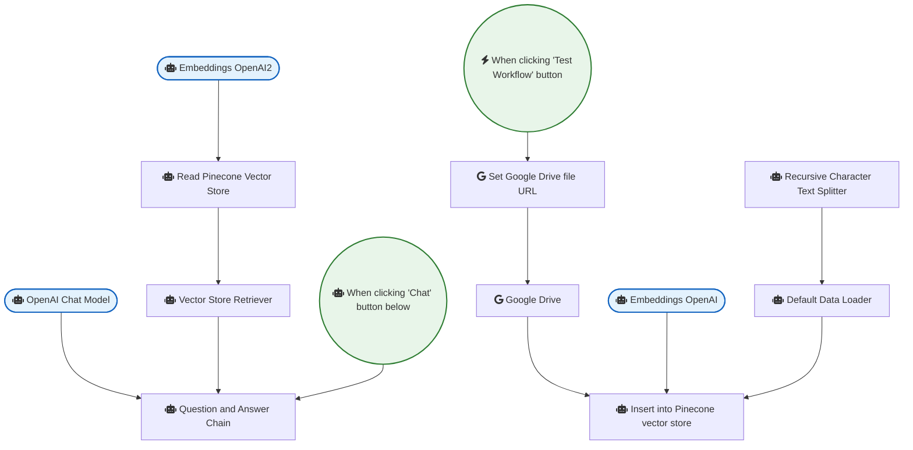

```mermaid
graph TD
    classDef trigger fill:#e8f5e9,stroke:#2e7d32,stroke-width:2px;
    classDef ai fill:#e3f2fd,stroke:#1565c0,stroke-width:2px;
    classDef logic fill:#fff3e0,stroke:#ef6c00,stroke-width:2px;

    Google_Drive["fab:fa-google Google Drive"]
    Recursive_Character_Text_Splitter["fas:fa-robot Recursive Character Text Splitter"]
    Embeddings_OpenAI(["fas:fa-robot Embeddings OpenAI"]):::ai
    Default_Data_Loader["fas:fa-robot Default Data Loader"]
    Question_and_Answer_Chain["fas:fa-robot Question and Answer Chain"]
    OpenAI_Chat_Model(["fas:fa-robot OpenAI Chat Model"]):::ai
    Embeddings_OpenAI2(["fas:fa-robot Embeddings OpenAI2"]):::ai
    Vector_Store_Retriever["fas:fa-robot Vector Store Retriever"]
    Read_Pinecone_Vector_Store["fas:fa-robot Read Pinecone Vector Store"]
    Insert_into_Pinecone_vector_store["fas:fa-robot Insert into Pinecone vector store"]
    When_clicking__Chat__button_below(("fas:fa-robot When clicking 'Chat' button below")):::trigger
    When_clicking__Test_Workflow__button(("fas:fa-bolt When clicking 'Test Workflow' button")):::trigger
    Set_Google_Drive_file_URL["fab:fa-google Set Google Drive file URL"]

    Google_Drive --> Insert_into_Pinecone_vector_store
    Embeddings_OpenAI --> Insert_into_Pinecone_vector_store
    OpenAI_Chat_Model --> Question_and_Answer_Chain
    Embeddings_OpenAI2 --> Read_Pinecone_Vector_Store
    Default_Data_Loader --> Insert_into_Pinecone_vector_store
    Vector_Store_Retriever --> Question_and_Answer_Chain
    Set_Google_Drive_file_URL --> Google_Drive
    Read_Pinecone_Vector_Store --> Vector_Store_Retriever
    Recursive_Character_Text_Splitter --> Default_Data_Loader
    When_clicking__Chat__button_below --> Question_and_Answer_Chain
    When_clicking__Test_Workflow__button --> Set_Google_Drive_file_URL
```
