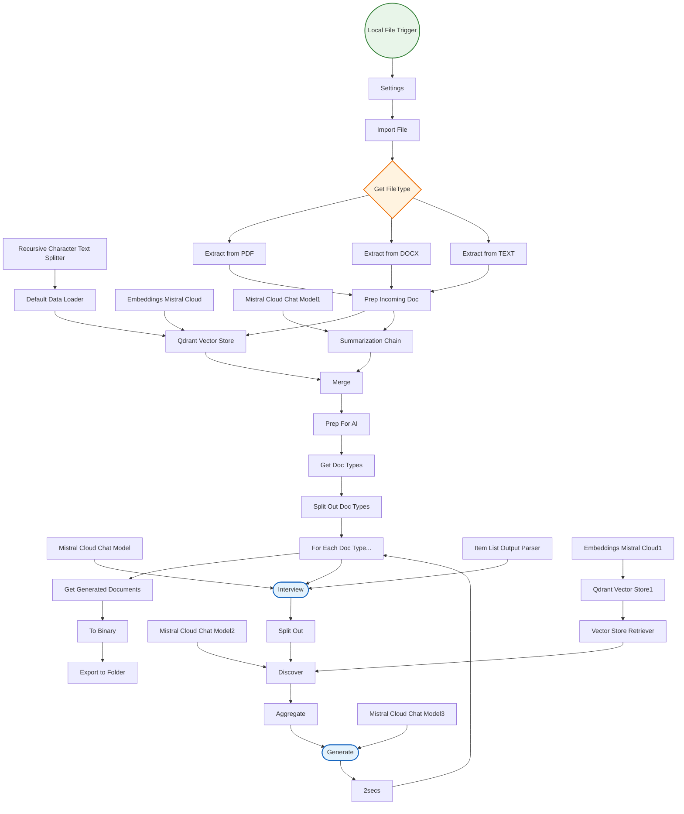

```mermaid
graph TD
    classDef trigger fill:#e8f5e9,stroke:#2e7d32,stroke-width:2px;
    classDef ai fill:#e3f2fd,stroke:#1565c0,stroke-width:2px;
    classDef logic fill:#fff3e0,stroke:#ef6c00,stroke-width:2px;

    Local_File_Trigger(("Local File Trigger")):::trigger
    Default_Data_Loader["Default Data Loader"]
    Recursive_Character_Text_Splitter["Recursive Character Text Splitter"]
    Embeddings_Mistral_Cloud["Embeddings Mistral Cloud"]
    Mistral_Cloud_Chat_Model["Mistral Cloud Chat Model"]
    Mistral_Cloud_Chat_Model1["Mistral Cloud Chat Model1"]
    Prep_Incoming_Doc["Prep Incoming Doc"]
    Settings["Settings"]
    Merge["Merge"]
    Get_Doc_Types["Get Doc Types"]
    Split_Out_Doc_Types["Split Out Doc Types"]
    For_Each_Doc_Type___["For Each Doc Type..."]
    Item_List_Output_Parser["Item List Output Parser"]
    Vector_Store_Retriever["Vector Store Retriever"]
    Embeddings_Mistral_Cloud1["Embeddings Mistral Cloud1"]
    Qdrant_Vector_Store1["Qdrant Vector Store1"]
    Mistral_Cloud_Chat_Model2["Mistral Cloud Chat Model2"]
    Split_Out["Split Out"]
    Aggregate["Aggregate"]
    Mistral_Cloud_Chat_Model3["Mistral Cloud Chat Model3"]
    Discover["Discover"]
    n_2secs["2secs"]
    Get_Generated_Documents["Get Generated Documents"]
    Generate(["Generate"]):::ai
    Prep_For_AI["Prep For AI"]
    To_Binary["To Binary"]
    Export_to_Folder["Export to Folder"]
    Get_FileType{"Get FileType"}:::logic
    Import_File["Import File"]
    Extract_from_PDF["Extract from PDF"]
    Extract_from_DOCX["Extract from DOCX"]
    Extract_from_TEXT["Extract from TEXT"]
    Summarization_Chain["Summarization Chain"]
    Qdrant_Vector_Store["Qdrant Vector Store"]
    Interview(["Interview"]):::ai

    n_2secs --> For_Each_Doc_Type___
    Merge --> Prep_For_AI
    Discover --> Aggregate
    Generate --> n_2secs
    Settings --> Import_File
    Aggregate --> Generate
    Interview --> Split_Out
    Split_Out --> Discover
    To_Binary --> Export_to_Folder
    Import_File --> Get_FileType
    Prep_For_AI --> Get_Doc_Types
    Get_FileType --> Extract_from_PDF
    Get_FileType --> Extract_from_DOCX
    Get_FileType --> Extract_from_TEXT
    Get_Doc_Types --> Split_Out_Doc_Types
    Extract_from_PDF --> Prep_Incoming_Doc
    Extract_from_DOCX --> Prep_Incoming_Doc
    Extract_from_TEXT --> Prep_Incoming_Doc
    Prep_Incoming_Doc --> Qdrant_Vector_Store
    Prep_Incoming_Doc --> Summarization_Chain
    Local_File_Trigger --> Settings
    Default_Data_Loader --> Qdrant_Vector_Store
    Qdrant_Vector_Store --> Merge
    Split_Out_Doc_Types --> For_Each_Doc_Type___
    Summarization_Chain --> Merge
    For_Each_Doc_Type___ --> Get_Generated_Documents
    For_Each_Doc_Type___ --> Interview
    Qdrant_Vector_Store1 --> Vector_Store_Retriever
    Vector_Store_Retriever --> Discover
    Get_Generated_Documents --> To_Binary
    Item_List_Output_Parser --> Interview
    Embeddings_Mistral_Cloud --> Qdrant_Vector_Store
    Mistral_Cloud_Chat_Model --> Interview
    Embeddings_Mistral_Cloud1 --> Qdrant_Vector_Store1
    Mistral_Cloud_Chat_Model1 --> Summarization_Chain
    Mistral_Cloud_Chat_Model2 --> Discover
    Mistral_Cloud_Chat_Model3 --> Generate
    Recursive_Character_Text_Splitter --> Default_Data_Loader
```
