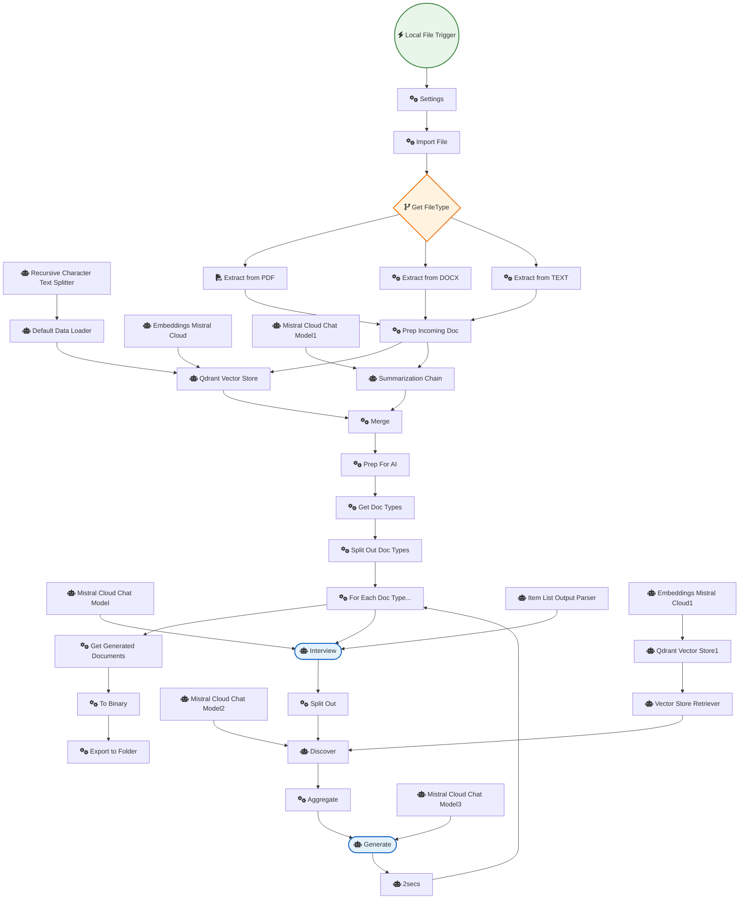

```mermaid
graph TD
    classDef trigger fill:#e8f5e9,stroke:#2e7d32,stroke-width:2px;
    classDef ai fill:#e3f2fd,stroke:#1565c0,stroke-width:2px;
    classDef logic fill:#fff3e0,stroke:#ef6c00,stroke-width:2px;

    Local_File_Trigger(("fas:fa-bolt Local File Trigger")):::trigger
    Default_Data_Loader["fas:fa-robot Default Data Loader"]
    Recursive_Character_Text_Splitter["fas:fa-robot Recursive Character Text Splitter"]
    Embeddings_Mistral_Cloud["fas:fa-robot Embeddings Mistral Cloud"]
    Mistral_Cloud_Chat_Model["fas:fa-robot Mistral Cloud Chat Model"]
    Mistral_Cloud_Chat_Model1["fas:fa-robot Mistral Cloud Chat Model1"]
    Prep_Incoming_Doc["fas:fa-cogs Prep Incoming Doc"]
    Settings["fas:fa-cogs Settings"]
    Merge["fas:fa-cogs Merge"]
    Get_Doc_Types["fas:fa-cogs Get Doc Types"]
    Split_Out_Doc_Types["fas:fa-cogs Split Out Doc Types"]
    For_Each_Doc_Type___["fas:fa-cogs For Each Doc Type..."]
    Item_List_Output_Parser["fas:fa-robot Item List Output Parser"]
    Vector_Store_Retriever["fas:fa-robot Vector Store Retriever"]
    Embeddings_Mistral_Cloud1["fas:fa-robot Embeddings Mistral Cloud1"]
    Qdrant_Vector_Store1["fas:fa-robot Qdrant Vector Store1"]
    Mistral_Cloud_Chat_Model2["fas:fa-robot Mistral Cloud Chat Model2"]
    Split_Out["fas:fa-cogs Split Out"]
    Aggregate["fas:fa-cogs Aggregate"]
    Mistral_Cloud_Chat_Model3["fas:fa-robot Mistral Cloud Chat Model3"]
    Discover["fas:fa-robot Discover"]
    n_2secs["fas:fa-robot 2secs"]
    Get_Generated_Documents["fas:fa-cogs Get Generated Documents"]
    Generate(["fas:fa-robot Generate"]):::ai
    Prep_For_AI["fas:fa-cogs Prep For AI"]
    To_Binary["fas:fa-cogs To Binary"]
    Export_to_Folder["fas:fa-cogs Export to Folder"]
    Get_FileType{"fas:fa-code-branch Get FileType"}:::logic
    Import_File["fas:fa-cogs Import File"]
    Extract_from_PDF["fas:fa-file-pdf Extract from PDF"]
    Extract_from_DOCX["fas:fa-cogs Extract from DOCX"]
    Extract_from_TEXT["fas:fa-cogs Extract from TEXT"]
    Summarization_Chain["fas:fa-robot Summarization Chain"]
    Qdrant_Vector_Store["fas:fa-robot Qdrant Vector Store"]
    Interview(["fas:fa-robot Interview"]):::ai

    n_2secs --> For_Each_Doc_Type___
    Merge --> Prep_For_AI
    Discover --> Aggregate
    Generate --> n_2secs
    Settings --> Import_File
    Aggregate --> Generate
    Interview --> Split_Out
    Split_Out --> Discover
    To_Binary --> Export_to_Folder
    Import_File --> Get_FileType
    Prep_For_AI --> Get_Doc_Types
    Get_FileType --> Extract_from_PDF
    Get_FileType --> Extract_from_DOCX
    Get_FileType --> Extract_from_TEXT
    Get_Doc_Types --> Split_Out_Doc_Types
    Extract_from_PDF --> Prep_Incoming_Doc
    Extract_from_DOCX --> Prep_Incoming_Doc
    Extract_from_TEXT --> Prep_Incoming_Doc
    Prep_Incoming_Doc --> Qdrant_Vector_Store
    Prep_Incoming_Doc --> Summarization_Chain
    Local_File_Trigger --> Settings
    Default_Data_Loader --> Qdrant_Vector_Store
    Qdrant_Vector_Store --> Merge
    Split_Out_Doc_Types --> For_Each_Doc_Type___
    Summarization_Chain --> Merge
    For_Each_Doc_Type___ --> Get_Generated_Documents
    For_Each_Doc_Type___ --> Interview
    Qdrant_Vector_Store1 --> Vector_Store_Retriever
    Vector_Store_Retriever --> Discover
    Get_Generated_Documents --> To_Binary
    Item_List_Output_Parser --> Interview
    Embeddings_Mistral_Cloud --> Qdrant_Vector_Store
    Mistral_Cloud_Chat_Model --> Interview
    Embeddings_Mistral_Cloud1 --> Qdrant_Vector_Store1
    Mistral_Cloud_Chat_Model1 --> Summarization_Chain
    Mistral_Cloud_Chat_Model2 --> Discover
    Mistral_Cloud_Chat_Model3 --> Generate
    Recursive_Character_Text_Splitter --> Default_Data_Loader
```
