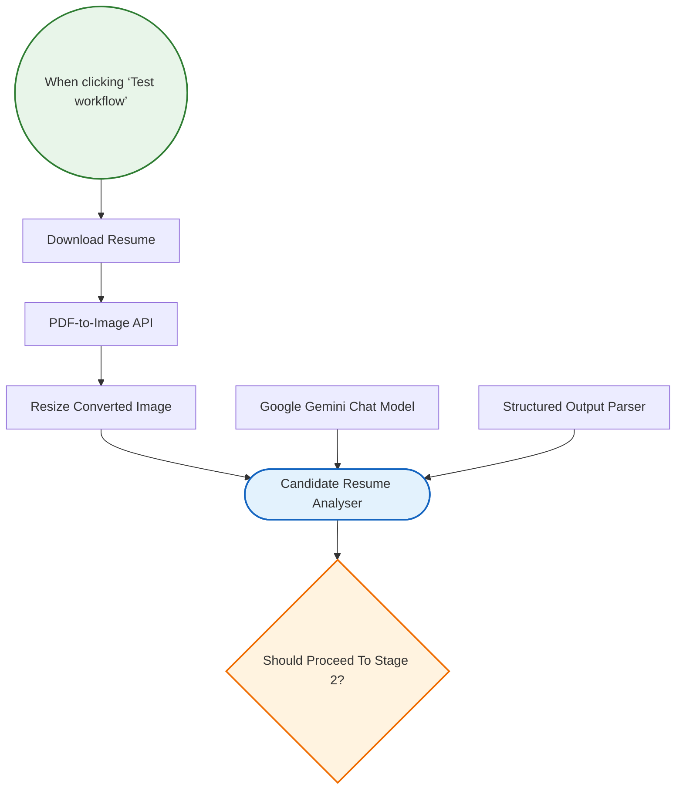

```mermaid
graph TD
    classDef trigger fill:#e8f5e9,stroke:#2e7d32,stroke-width:2px;
    classDef ai fill:#e3f2fd,stroke:#1565c0,stroke-width:2px;
    classDef logic fill:#fff3e0,stroke:#ef6c00,stroke-width:2px;

    When_clicking__Test_workflow_(("When clicking ‘Test workflow’")):::trigger
    Structured_Output_Parser["Structured Output Parser"]
    Should_Proceed_To_Stage_2_{"Should Proceed To Stage 2?"}:::logic
    Download_Resume["Download Resume"]
    PDF_to_Image_API["PDF-to-Image API"]
    Resize_Converted_Image["Resize Converted Image"]
    Google_Gemini_Chat_Model["Google Gemini Chat Model"]
    Candidate_Resume_Analyser(["Candidate Resume Analyser"]):::ai

    Download_Resume --> PDF_to_Image_API
    PDF_to_Image_API --> Resize_Converted_Image
    Resize_Converted_Image --> Candidate_Resume_Analyser
    Google_Gemini_Chat_Model --> Candidate_Resume_Analyser
    Structured_Output_Parser --> Candidate_Resume_Analyser
    Candidate_Resume_Analyser --> Should_Proceed_To_Stage_2_
    When_clicking__Test_workflow_ --> Download_Resume
```
