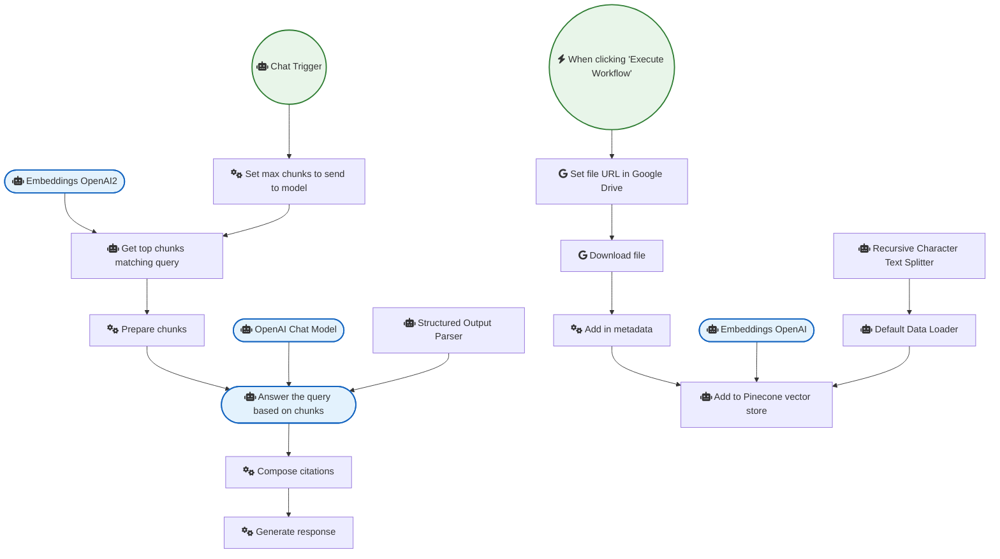

```mermaid
graph TD
    classDef trigger fill:#e8f5e9,stroke:#2e7d32,stroke-width:2px;
    classDef ai fill:#e3f2fd,stroke:#1565c0,stroke-width:2px;
    classDef logic fill:#fff3e0,stroke:#ef6c00,stroke-width:2px;

    When_clicking__Execute_Workflow_(("fas:fa-bolt When clicking 'Execute Workflow'")):::trigger
    Embeddings_OpenAI(["fas:fa-robot Embeddings OpenAI"]):::ai
    Default_Data_Loader["fas:fa-robot Default Data Loader"]
    Set_file_URL_in_Google_Drive["fab:fa-google Set file URL in Google Drive"]
    Add_in_metadata["fas:fa-cogs Add in metadata"]
    Download_file["fab:fa-google Download file"]
    Chat_Trigger(("fas:fa-robot Chat Trigger")):::trigger
    Prepare_chunks["fas:fa-cogs Prepare chunks"]
    Embeddings_OpenAI2(["fas:fa-robot Embeddings OpenAI2"]):::ai
    OpenAI_Chat_Model(["fas:fa-robot OpenAI Chat Model"]):::ai
    Set_max_chunks_to_send_to_model["fas:fa-cogs Set max chunks to send to model"]
    Structured_Output_Parser["fas:fa-robot Structured Output Parser"]
    Compose_citations["fas:fa-cogs Compose citations"]
    Generate_response["fas:fa-cogs Generate response"]
    Answer_the_query_based_on_chunks(["fas:fa-robot Answer the query based on chunks"]):::ai
    Get_top_chunks_matching_query["fas:fa-robot Get top chunks matching query"]
    Add_to_Pinecone_vector_store["fas:fa-robot Add to Pinecone vector store"]
    Recursive_Character_Text_Splitter["fas:fa-robot Recursive Character Text Splitter"]

    Chat_Trigger --> Set_max_chunks_to_send_to_model
    Download_file --> Add_in_metadata
    Prepare_chunks --> Answer_the_query_based_on_chunks
    Add_in_metadata --> Add_to_Pinecone_vector_store
    Compose_citations --> Generate_response
    Embeddings_OpenAI --> Add_to_Pinecone_vector_store
    OpenAI_Chat_Model --> Answer_the_query_based_on_chunks
    Embeddings_OpenAI2 --> Get_top_chunks_matching_query
    Default_Data_Loader --> Add_to_Pinecone_vector_store
    Structured_Output_Parser --> Answer_the_query_based_on_chunks
    Set_file_URL_in_Google_Drive --> Download_file
    Get_top_chunks_matching_query --> Prepare_chunks
    Set_max_chunks_to_send_to_model --> Get_top_chunks_matching_query
    Answer_the_query_based_on_chunks --> Compose_citations
    When_clicking__Execute_Workflow_ --> Set_file_URL_in_Google_Drive
    Recursive_Character_Text_Splitter --> Default_Data_Loader
```
