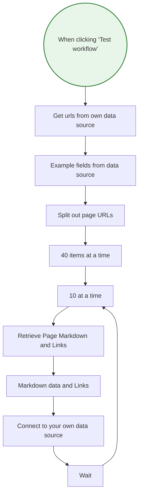

```mermaid
graph TD
    classDef trigger fill:#e8f5e9,stroke:#2e7d32,stroke-width:2px;
    classDef ai fill:#e3f2fd,stroke:#1565c0,stroke-width:2px;
    classDef logic fill:#fff3e0,stroke:#ef6c00,stroke-width:2px;

    When_clicking__Test_workflow_(("When clicking ‘Test workflow’")):::trigger
    Wait["Wait"]
    Connect_to_your_own_data_source["Connect to your own data source"]
    Get_urls_from_own_data_source["Get urls from own data source"]
    Example_fields_from_data_source["Example fields from data source"]
    n_40_items_at_a_time["40 items at a time"]
    n_10_at_a_time["10 at a time"]
    Markdown_data_and_Links["Markdown data and Links"]
    Split_out_page_URLs["Split out page URLs"]
    Retrieve_Page_Markdown_and_Links["Retrieve Page Markdown and Links"]

    Wait --> n_10_at_a_time
    n_10_at_a_time --> Retrieve_Page_Markdown_and_Links
    n_40_items_at_a_time --> n_10_at_a_time
    Split_out_page_URLs --> n_40_items_at_a_time
    Markdown_data_and_Links --> Connect_to_your_own_data_source
    Get_urls_from_own_data_source --> Example_fields_from_data_source
    Connect_to_your_own_data_source --> Wait
    Example_fields_from_data_source --> Split_out_page_URLs
    Retrieve_Page_Markdown_and_Links --> Markdown_data_and_Links
    When_clicking__Test_workflow_ --> Get_urls_from_own_data_source
```
