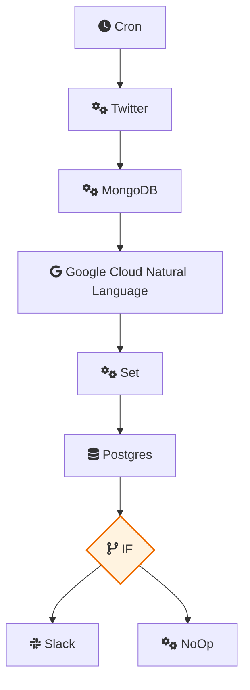

```mermaid
graph TD
    classDef trigger fill:#e8f5e9,stroke:#2e7d32,stroke-width:2px;
    classDef ai fill:#e3f2fd,stroke:#1565c0,stroke-width:2px;
    classDef logic fill:#fff3e0,stroke:#ef6c00,stroke-width:2px;

    Twitter["fas:fa-cogs Twitter"]
    Postgres["fas:fa-database Postgres"]
    MongoDB["fas:fa-cogs MongoDB"]
    Slack["fab:fa-slack Slack"]
    IF{"fas:fa-code-branch IF"}:::logic
    NoOp["fas:fa-cogs NoOp"]
    Google_Cloud_Natural_Language["fab:fa-google Google Cloud Natural Language"]
    Set["fas:fa-cogs Set"]
    Cron["fas:fa-clock Cron"]

    IF --> Slack
    IF --> NoOp
    Set --> Postgres
    Cron --> Twitter
    MongoDB --> Google_Cloud_Natural_Language
    Twitter --> MongoDB
    Postgres --> IF
    Google_Cloud_Natural_Language --> Set
```
