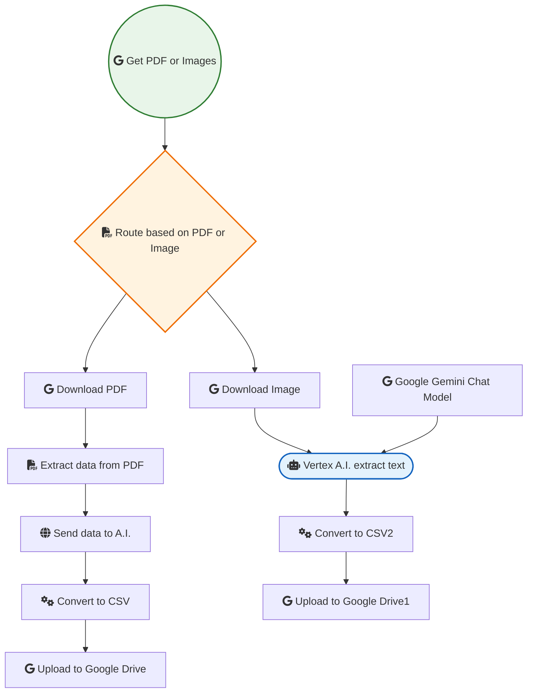

```mermaid
graph TD
    classDef trigger fill:#e8f5e9,stroke:#2e7d32,stroke-width:2px;
    classDef ai fill:#e3f2fd,stroke:#1565c0,stroke-width:2px;
    classDef logic fill:#fff3e0,stroke:#ef6c00,stroke-width:2px;

    Google_Gemini_Chat_Model["fab:fa-google Google Gemini Chat Model"]
    Get_PDF_or_Images(("fab:fa-google Get PDF or Images")):::trigger
    Route_based_on_PDF_or_Image{"fas:fa-file-pdf Route based on PDF or Image"}:::logic
    Download_PDF["fab:fa-google Download PDF"]
    Download_Image["fab:fa-google Download Image"]
    Extract_data_from_PDF["fas:fa-file-pdf Extract data from PDF"]
    Send_data_to_A_I_["fas:fa-globe Send data to A.I."]
    Convert_to_CSV["fas:fa-cogs Convert to CSV"]
    Upload_to_Google_Drive["fab:fa-google Upload to Google Drive"]
    Convert_to_CSV2["fas:fa-cogs Convert to CSV2"]
    Upload_to_Google_Drive1["fab:fa-google Upload to Google Drive1"]
    Vertex_A_I__extract_text(["fas:fa-robot Vertex A.I. extract text"]):::ai

    Download_PDF --> Extract_data_from_PDF
    Convert_to_CSV --> Upload_to_Google_Drive
    Download_Image --> Vertex_A_I__extract_text
    Convert_to_CSV2 --> Upload_to_Google_Drive1
    Get_PDF_or_Images --> Route_based_on_PDF_or_Image
    Send_data_to_A_I_ --> Convert_to_CSV
    Extract_data_from_PDF --> Send_data_to_A_I_
    Google_Gemini_Chat_Model --> Vertex_A_I__extract_text
    Vertex_A_I__extract_text --> Convert_to_CSV2
    Route_based_on_PDF_or_Image --> Download_PDF
    Route_based_on_PDF_or_Image --> Download_Image
```
