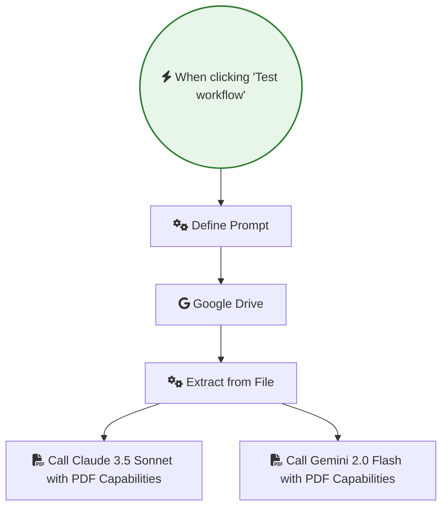

```mermaid
graph TD
    classDef trigger fill:#e8f5e9,stroke:#2e7d32,stroke-width:2px;
    classDef ai fill:#e3f2fd,stroke:#1565c0,stroke-width:2px;
    classDef logic fill:#fff3e0,stroke:#ef6c00,stroke-width:2px;

    When_clicking__Test_workflow_(("fas:fa-bolt When clicking 'Test workflow'")):::trigger
    Extract_from_File["fas:fa-cogs Extract from File"]
    Google_Drive["fab:fa-google Google Drive"]
    Call_Gemini_2_0_Flash_with_PDF_Capabilities["fas:fa-file-pdf Call Gemini 2.0 Flash with PDF Capabilities"]
    Call_Claude_3_5_Sonnet_with_PDF_Capabilities["fas:fa-file-pdf Call Claude 3.5 Sonnet with PDF Capabilities"]
    Define_Prompt["fas:fa-cogs Define Prompt"]

    Google_Drive --> Extract_from_File
    Define_Prompt --> Google_Drive
    Extract_from_File --> Call_Claude_3_5_Sonnet_with_PDF_Capabilities
    Extract_from_File --> Call_Gemini_2_0_Flash_with_PDF_Capabilities
    When_clicking__Test_workflow_ --> Define_Prompt
```
