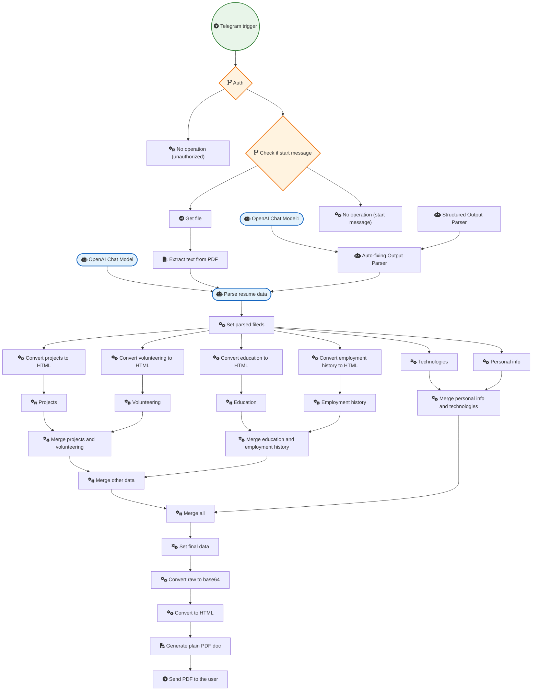

```mermaid
graph TD
    classDef trigger fill:#e8f5e9,stroke:#2e7d32,stroke-width:2px;
    classDef ai fill:#e3f2fd,stroke:#1565c0,stroke-width:2px;
    classDef logic fill:#fff3e0,stroke:#ef6c00,stroke-width:2px;

    OpenAI_Chat_Model(["fas:fa-robot OpenAI Chat Model"]):::ai
    Convert_education_to_HTML["fas:fa-cogs Convert education to HTML"]
    Auto_fixing_Output_Parser["fas:fa-robot Auto-fixing Output Parser"]
    OpenAI_Chat_Model1(["fas:fa-robot OpenAI Chat Model1"]):::ai
    Structured_Output_Parser["fas:fa-robot Structured Output Parser"]
    Convert_employment_history_to_HTML["fas:fa-cogs Convert employment history to HTML"]
    Convert_projects_to_HTML["fas:fa-cogs Convert projects to HTML"]
    Convert_volunteering_to_HTML["fas:fa-cogs Convert volunteering to HTML"]
    Telegram_trigger(("fab:fa-telegram Telegram trigger")):::trigger
    Auth{"fas:fa-code-branch Auth"}:::logic
    No_operation__unauthorized_["fas:fa-cogs No operation (unauthorized)"]
    Check_if_start_message{"fas:fa-code-branch Check if start message"}:::logic
    No_operation__start_message_["fas:fa-cogs No operation (start message)"]
    Get_file["fab:fa-telegram Get file"]
    Extract_text_from_PDF["fas:fa-file-pdf Extract text from PDF"]
    Set_parsed_fileds["fas:fa-cogs Set parsed fileds"]
    Personal_info["fas:fa-cogs Personal info"]
    Technologies["fas:fa-cogs Technologies"]
    Employment_history["fas:fa-cogs Employment history"]
    Education["fas:fa-cogs Education"]
    Projects["fas:fa-cogs Projects"]
    Volunteering["fas:fa-cogs Volunteering"]
    Merge_education_and_employment_history["fas:fa-cogs Merge education and employment history"]
    Merge_projects_and_volunteering["fas:fa-cogs Merge projects and volunteering"]
    Merge_personal_info_and_technologies["fas:fa-cogs Merge personal info and technologies"]
    Merge_all["fas:fa-cogs Merge all"]
    Set_final_data["fas:fa-cogs Set final data"]
    Convert_raw_to_base64["fas:fa-cogs Convert raw to base64"]
    Convert_to_HTML["fas:fa-cogs Convert to HTML"]
    Generate_plain_PDF_doc["fas:fa-file-pdf Generate plain PDF doc"]
    Send_PDF_to_the_user["fab:fa-telegram Send PDF to the user"]
    Parse_resume_data(["fas:fa-robot Parse resume data"]):::ai
    Merge_other_data["fas:fa-cogs Merge other data"]

    Auth --> Check_if_start_message
    Auth --> No_operation__unauthorized_
    Get_file --> Extract_text_from_PDF
    Projects --> Merge_projects_and_volunteering
    Education --> Merge_education_and_employment_history
    Merge_all --> Set_final_data
    Technologies --> Merge_personal_info_and_technologies
    Volunteering --> Merge_projects_and_volunteering
    Personal_info --> Merge_personal_info_and_technologies
    Set_final_data --> Convert_raw_to_base64
    Convert_to_HTML --> Generate_plain_PDF_doc
    Merge_other_data --> Merge_all
    Telegram_trigger --> Auth
    OpenAI_Chat_Model --> Parse_resume_data
    Parse_resume_data --> Set_parsed_fileds
    Set_parsed_fileds --> Convert_employment_history_to_HTML
    Set_parsed_fileds --> Convert_education_to_HTML
    Set_parsed_fileds --> Convert_projects_to_HTML
    Set_parsed_fileds --> Personal_info
    Set_parsed_fileds --> Convert_volunteering_to_HTML
    Set_parsed_fileds --> Technologies
    Employment_history --> Merge_education_and_employment_history
    OpenAI_Chat_Model1 --> Auto_fixing_Output_Parser
    Convert_raw_to_base64 --> Convert_to_HTML
    Extract_text_from_PDF --> Parse_resume_data
    Check_if_start_message --> Get_file
    Check_if_start_message --> No_operation__start_message_
    Generate_plain_PDF_doc --> Send_PDF_to_the_user
    Convert_projects_to_HTML --> Projects
    Structured_Output_Parser --> Auto_fixing_Output_Parser
    Auto_fixing_Output_Parser --> Parse_resume_data
    Convert_education_to_HTML --> Education
    Convert_volunteering_to_HTML --> Volunteering
    Merge_projects_and_volunteering --> Merge_other_data
    Convert_employment_history_to_HTML --> Employment_history
    Merge_personal_info_and_technologies --> Merge_all
    Merge_education_and_employment_history --> Merge_other_data
```
