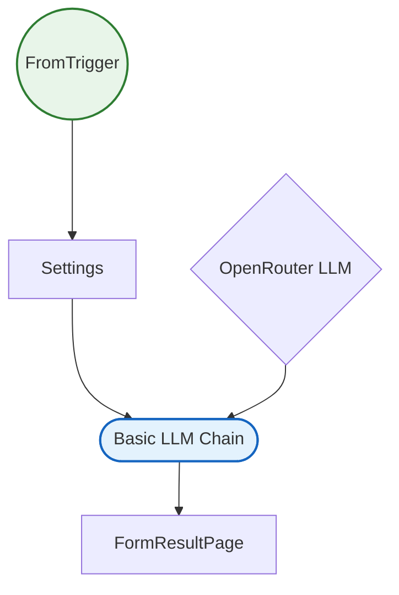

```mermaid
graph TD
    classDef trigger fill:#e8f5e9,stroke:#2e7d32,stroke-width:2px;
    classDef ai fill:#e3f2fd,stroke:#1565c0,stroke-width:2px;
    classDef logic fill:#fff3e0,stroke:#ef6c00,stroke-width:2px;

    Basic_LLM_Chain(["Basic LLM Chain"]):::ai
    FormResultPage["FormResultPage"]
    OpenRouter_LLM{"OpenRouter LLM"}
    Settings["Settings"]
    FromTrigger(("FromTrigger")):::trigger

    Settings --> Basic_LLM_Chain
    FromTrigger --> Settings
    OpenRouter_LLM --> Basic_LLM_Chain
    Basic_LLM_Chain --> FormResultPage
```
