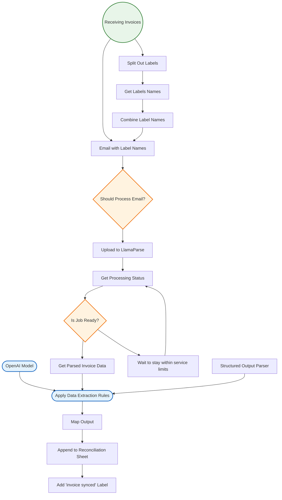

```mermaid
graph TD
    classDef trigger fill:#e8f5e9,stroke:#2e7d32,stroke-width:2px;
    classDef ai fill:#e3f2fd,stroke:#1565c0,stroke-width:2px;
    classDef logic fill:#fff3e0,stroke:#ef6c00,stroke-width:2px;

    OpenAI_Model(["OpenAI Model"]):::ai
    Structured_Output_Parser["Structured Output Parser"]
    Upload_to_LlamaParse["Upload to LlamaParse"]
    Receiving_Invoices(("Receiving Invoices")):::trigger
    Append_to_Reconciliation_Sheet["Append to Reconciliation Sheet"]
    Get_Processing_Status["Get Processing Status"]
    Wait_to_stay_within_service_limits["Wait to stay within service limits"]
    Is_Job_Ready_{"Is Job Ready?"}:::logic
    Add__invoice_synced__Label["Add 'invoice synced' Label"]
    Get_Parsed_Invoice_Data["Get Parsed Invoice Data"]
    Map_Output["Map Output"]
    Apply_Data_Extraction_Rules(["Apply Data Extraction Rules"]):::ai
    Should_Process_Email_{"Should Process Email?"}:::logic
    Split_Out_Labels["Split Out Labels"]
    Get_Labels_Names["Get Labels Names"]
    Combine_Label_Names["Combine Label Names"]
    Email_with_Label_Names["Email with Label Names"]

    Map_Output --> Append_to_Reconciliation_Sheet
    OpenAI_Model --> Apply_Data_Extraction_Rules
    Is_Job_Ready_ --> Get_Parsed_Invoice_Data
    Is_Job_Ready_ --> Wait_to_stay_within_service_limits
    Get_Labels_Names --> Combine_Label_Names
    Split_Out_Labels --> Get_Labels_Names
    Receiving_Invoices --> Split_Out_Labels
    Receiving_Invoices --> Email_with_Label_Names
    Combine_Label_Names --> Email_with_Label_Names
    Upload_to_LlamaParse --> Get_Processing_Status
    Get_Processing_Status --> Is_Job_Ready_
    Should_Process_Email_ --> Upload_to_LlamaParse
    Email_with_Label_Names --> Should_Process_Email_
    Get_Parsed_Invoice_Data --> Apply_Data_Extraction_Rules
    Structured_Output_Parser --> Apply_Data_Extraction_Rules
    Apply_Data_Extraction_Rules --> Map_Output
    Append_to_Reconciliation_Sheet --> Add__invoice_synced__Label
    Wait_to_stay_within_service_limits --> Get_Processing_Status
```
