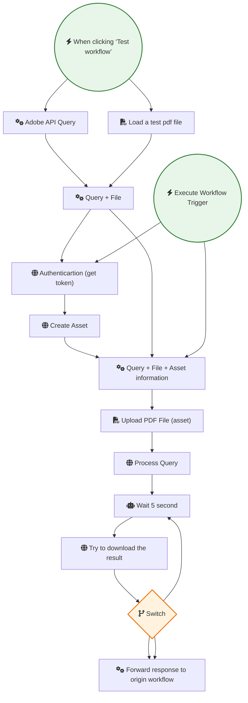

```mermaid
graph TD
    classDef trigger fill:#e8f5e9,stroke:#2e7d32,stroke-width:2px;
    classDef ai fill:#e3f2fd,stroke:#1565c0,stroke-width:2px;
    classDef logic fill:#fff3e0,stroke:#ef6c00,stroke-width:2px;

    When_clicking__Test_workflow_(("fas:fa-bolt When clicking ‘Test workflow’")):::trigger
    Create_Asset["fas:fa-globe Create Asset"]
    Execute_Workflow_Trigger(("fas:fa-bolt Execute Workflow Trigger")):::trigger
    Adobe_API_Query["fas:fa-cogs Adobe API Query"]
    Load_a_test_pdf_file["fas:fa-file-pdf Load a test pdf file"]
    Query___File["fas:fa-cogs Query + File"]
    Query___File___Asset_information["fas:fa-cogs Query + File + Asset information"]
    Process_Query["fas:fa-globe Process Query"]
    Wait_5_second["fas:fa-robot Wait 5 second"]
    Try_to_download_the_result["fas:fa-globe Try to download the result"]
    Switch{"fas:fa-code-branch Switch"}:::logic
    Forward_response_to_origin_workflow["fas:fa-cogs Forward response to origin workflow"]
    Authenticartion__get_token_["fas:fa-globe Authenticartion (get token)"]
    Upload_PDF_File__asset_["fas:fa-file-pdf Upload PDF File (asset)"]

    Switch --> Wait_5_second
    Switch --> Forward_response_to_origin_workflow
    Switch --> Forward_response_to_origin_workflow
    Create_Asset --> Query___File___Asset_information
    Query___File --> Authenticartion__get_token_
    Query___File --> Query___File___Asset_information
    Process_Query --> Wait_5_second
    Wait_5_second --> Try_to_download_the_result
    Adobe_API_Query --> Query___File
    Load_a_test_pdf_file --> Query___File
    Upload_PDF_File__asset_ --> Process_Query
    Execute_Workflow_Trigger --> Authenticartion__get_token_
    Execute_Workflow_Trigger --> Query___File___Asset_information
    Try_to_download_the_result --> Switch
    Authenticartion__get_token_ --> Create_Asset
    Query___File___Asset_information --> Upload_PDF_File__asset_
    When_clicking__Test_workflow_ --> Load_a_test_pdf_file
    When_clicking__Test_workflow_ --> Adobe_API_Query
```
