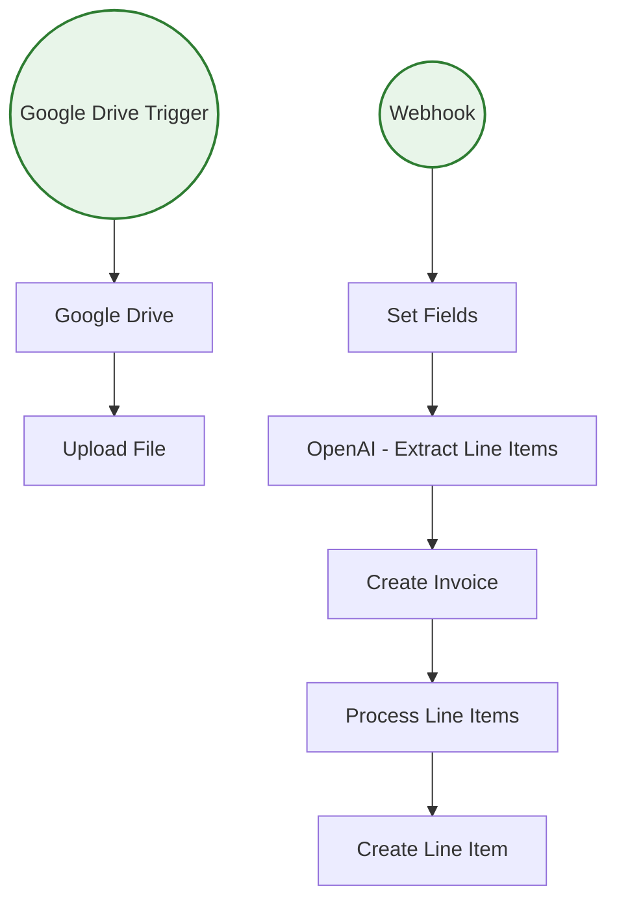

```mermaid
graph TD
    classDef trigger fill:#e8f5e9,stroke:#2e7d32,stroke-width:2px;
    classDef ai fill:#e3f2fd,stroke:#1565c0,stroke-width:2px;
    classDef logic fill:#fff3e0,stroke:#ef6c00,stroke-width:2px;

    Google_Drive["Google Drive"]
    Upload_File["Upload File"]
    Google_Drive_Trigger(("Google Drive Trigger")):::trigger
    Create_Invoice["Create Invoice"]
    Create_Line_Item["Create Line Item"]
    OpenAI___Extract_Line_Items["OpenAI - Extract Line Items"]
    Set_Fields["Set Fields"]
    Process_Line_Items["Process Line Items"]
    Webhook(("Webhook")):::trigger

    Webhook --> Set_Fields
    Set_Fields --> OpenAI___Extract_Line_Items
    Google_Drive --> Upload_File
    Create_Invoice --> Process_Line_Items
    Process_Line_Items --> Create_Line_Item
    Google_Drive_Trigger --> Google_Drive
    OpenAI___Extract_Line_Items --> Create_Invoice
```
