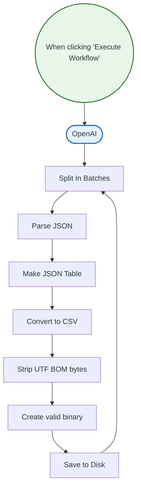

```mermaid
graph TD
    classDef trigger fill:#e8f5e9,stroke:#2e7d32,stroke-width:2px;
    classDef ai fill:#e3f2fd,stroke:#1565c0,stroke-width:2px;
    classDef logic fill:#fff3e0,stroke:#ef6c00,stroke-width:2px;

    When_clicking__Execute_Workflow_(("When clicking 'Execute Workflow'")):::trigger
    OpenAI(["OpenAI"]):::ai
    Split_In_Batches["Split In Batches"]
    Parse_JSON["Parse JSON"]
    Make_JSON_Table["Make JSON Table"]
    Convert_to_CSV["Convert to CSV"]
    Save_to_Disk["Save to Disk"]
    Strip_UTF_BOM_bytes["Strip UTF BOM bytes"]
    Create_valid_binary["Create valid binary"]

    OpenAI --> Split_In_Batches
    Parse_JSON --> Make_JSON_Table
    Save_to_Disk --> Split_In_Batches
    Convert_to_CSV --> Strip_UTF_BOM_bytes
    Make_JSON_Table --> Convert_to_CSV
    Split_In_Batches --> Parse_JSON
    Create_valid_binary --> Save_to_Disk
    Strip_UTF_BOM_bytes --> Create_valid_binary
    When_clicking__Execute_Workflow_ --> OpenAI
```
