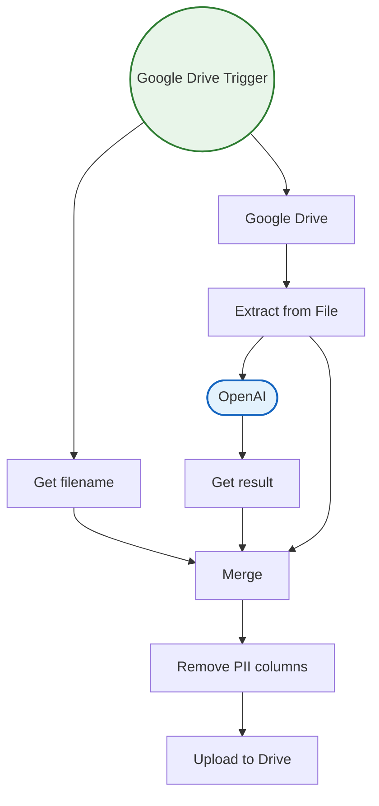

```mermaid
graph TD
    classDef trigger fill:#e8f5e9,stroke:#2e7d32,stroke-width:2px;
    classDef ai fill:#e3f2fd,stroke:#1565c0,stroke-width:2px;
    classDef logic fill:#fff3e0,stroke:#ef6c00,stroke-width:2px;

    Google_Drive_Trigger(("Google Drive Trigger")):::trigger
    Google_Drive["Google Drive"]
    Extract_from_File["Extract from File"]
    OpenAI(["OpenAI"]):::ai
    Merge["Merge"]
    Upload_to_Drive["Upload to Drive"]
    Get_filename["Get filename"]
    Get_result["Get result"]
    Remove_PII_columns["Remove PII columns"]

    Merge --> Remove_PII_columns
    OpenAI --> Get_result
    Get_result --> Merge
    Get_filename --> Merge
    Google_Drive --> Extract_from_File
    Extract_from_File --> OpenAI
    Extract_from_File --> Merge
    Remove_PII_columns --> Upload_to_Drive
    Google_Drive_Trigger --> Get_filename
    Google_Drive_Trigger --> Google_Drive
```
