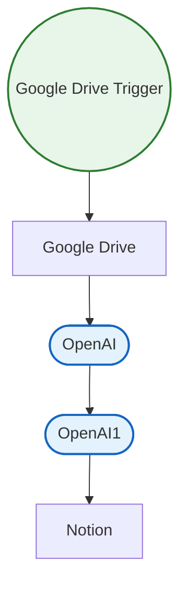

```mermaid
graph TD
    classDef trigger fill:#e8f5e9,stroke:#2e7d32,stroke-width:2px;
    classDef ai fill:#e3f2fd,stroke:#1565c0,stroke-width:2px;
    classDef logic fill:#fff3e0,stroke:#ef6c00,stroke-width:2px;

    Google_Drive_Trigger(("Google Drive Trigger")):::trigger
    Google_Drive["Google Drive"]
    Notion["Notion"]
    OpenAI(["OpenAI"]):::ai
    OpenAI1(["OpenAI1"]):::ai

    OpenAI --> OpenAI1
    OpenAI1 --> Notion
    Google_Drive --> OpenAI
    Google_Drive_Trigger --> Google_Drive
```
