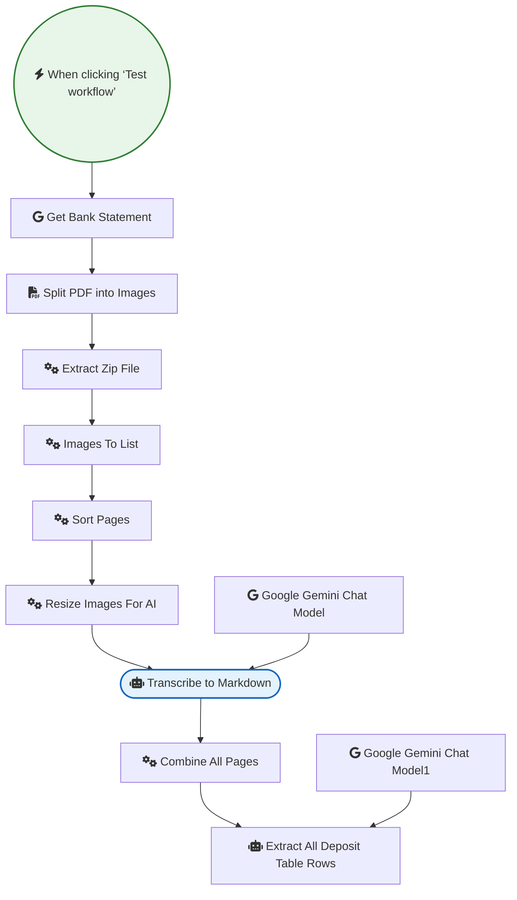

```mermaid
graph TD
    classDef trigger fill:#e8f5e9,stroke:#2e7d32,stroke-width:2px;
    classDef ai fill:#e3f2fd,stroke:#1565c0,stroke-width:2px;
    classDef logic fill:#fff3e0,stroke:#ef6c00,stroke-width:2px;

    When_clicking__Test_workflow_(("fas:fa-bolt When clicking ‘Test workflow’")):::trigger
    Google_Gemini_Chat_Model["fab:fa-google Google Gemini Chat Model"]
    Sort_Pages["fas:fa-cogs Sort Pages"]
    Get_Bank_Statement["fab:fa-google Get Bank Statement"]
    Split_PDF_into_Images["fas:fa-file-pdf Split PDF into Images"]
    Extract_Zip_File["fas:fa-cogs Extract Zip File"]
    Images_To_List["fas:fa-cogs Images To List"]
    Resize_Images_For_AI["fas:fa-cogs Resize Images For AI"]
    Google_Gemini_Chat_Model1["fab:fa-google Google Gemini Chat Model1"]
    Combine_All_Pages["fas:fa-cogs Combine All Pages"]
    Extract_All_Deposit_Table_Rows["fas:fa-robot Extract All Deposit Table Rows"]
    Transcribe_to_Markdown(["fas:fa-robot Transcribe to Markdown"]):::ai

    Sort_Pages --> Resize_Images_For_AI
    Images_To_List --> Sort_Pages
    Extract_Zip_File --> Images_To_List
    Combine_All_Pages --> Extract_All_Deposit_Table_Rows
    Get_Bank_Statement --> Split_PDF_into_Images
    Resize_Images_For_AI --> Transcribe_to_Markdown
    Split_PDF_into_Images --> Extract_Zip_File
    Transcribe_to_Markdown --> Combine_All_Pages
    Google_Gemini_Chat_Model --> Transcribe_to_Markdown
    Google_Gemini_Chat_Model1 --> Extract_All_Deposit_Table_Rows
    When_clicking__Test_workflow_ --> Get_Bank_Statement
```
