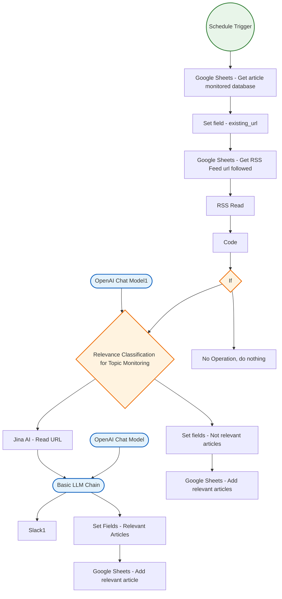

```mermaid
graph TD
    classDef trigger fill:#e8f5e9,stroke:#2e7d32,stroke-width:2px;
    classDef ai fill:#e3f2fd,stroke:#1565c0,stroke-width:2px;
    classDef logic fill:#fff3e0,stroke:#ef6c00,stroke-width:2px;

    OpenAI_Chat_Model(["OpenAI Chat Model"]):::ai
    Basic_LLM_Chain(["Basic LLM Chain"]):::ai
    Schedule_Trigger(("Schedule Trigger")):::trigger
    RSS_Read["RSS Read"]
    Relevance_Classification_for_Topic_Monitoring{"Relevance Classification for Topic Monitoring"}:::logic
    Google_Sheets___Get_RSS_Feed_url_followed["Google Sheets - Get RSS Feed url followed"]
    Slack1["Slack1"]
    Google_Sheets___Get_article_monitored_database["Google Sheets - Get article monitored database"]
    Code["Code"]
    No_Operation__do_nothing["No Operation, do nothing"]
    If{"If"}:::logic
    Jina_AI___Read_URL["Jina AI - Read URL"]
    Set_field___existing_url["Set field - existing_url"]
    OpenAI_Chat_Model1(["OpenAI Chat Model1"]):::ai
    Set_fields___Not_relevant_articles["Set fields - Not relevant articles"]
    Google_Sheets___Add_relevant_articles["Google Sheets - Add relevant articles"]
    Google_Sheets___Add_relevant_article["Google Sheets - Add relevant article"]
    Set_Fields___Relevant_Articles["Set Fields - Relevant Articles"]

    If --> Relevance_Classification_for_Topic_Monitoring
    If --> No_Operation__do_nothing
    Code --> If
    RSS_Read --> Code
    Basic_LLM_Chain --> Slack1
    Basic_LLM_Chain --> Set_Fields___Relevant_Articles
    Schedule_Trigger --> Google_Sheets___Get_article_monitored_database
    OpenAI_Chat_Model --> Basic_LLM_Chain
    Jina_AI___Read_URL --> Basic_LLM_Chain
    OpenAI_Chat_Model1 --> Relevance_Classification_for_Topic_Monitoring
    Set_field___existing_url --> Google_Sheets___Get_RSS_Feed_url_followed
    Set_Fields___Relevant_Articles --> Google_Sheets___Add_relevant_article
    Set_fields___Not_relevant_articles --> Google_Sheets___Add_relevant_articles
    Google_Sheets___Get_RSS_Feed_url_followed --> RSS_Read
    Relevance_Classification_for_Topic_Monitoring --> Jina_AI___Read_URL
    Relevance_Classification_for_Topic_Monitoring --> Set_fields___Not_relevant_articles
    Google_Sheets___Get_article_monitored_database --> Set_field___existing_url
```
