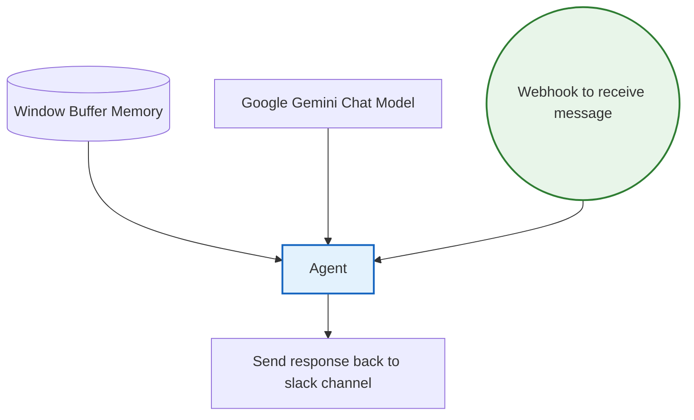

```mermaid
graph TD
    classDef trigger fill:#e8f5e9,stroke:#2e7d32,stroke-width:2px;
    classDef ai fill:#e3f2fd,stroke:#1565c0,stroke-width:2px;
    classDef logic fill:#fff3e0,stroke:#ef6c00,stroke-width:2px;

    Google_Gemini_Chat_Model["Google Gemini Chat Model"]
    Window_Buffer_Memory[("Window Buffer Memory")]
    Send_response_back_to_slack_channel["Send response back to slack channel"]
    Webhook_to_receive_message(("Webhook to receive message")):::trigger
    Agent["Agent"]:::ai

    Agent --> Send_response_back_to_slack_channel
    Window_Buffer_Memory --> Agent
    Google_Gemini_Chat_Model --> Agent
    Webhook_to_receive_message --> Agent
```
