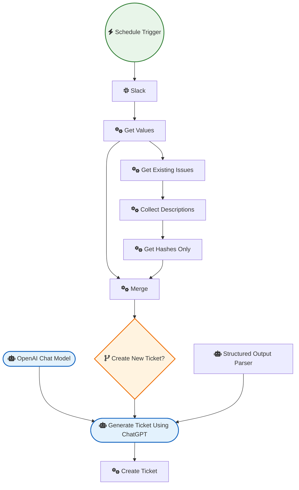

```mermaid
graph TD
    classDef trigger fill:#e8f5e9,stroke:#2e7d32,stroke-width:2px;
    classDef ai fill:#e3f2fd,stroke:#1565c0,stroke-width:2px;
    classDef logic fill:#fff3e0,stroke:#ef6c00,stroke-width:2px;

    Slack["fab:fa-slack Slack"]
    OpenAI_Chat_Model(["fas:fa-robot OpenAI Chat Model"]):::ai
    Structured_Output_Parser["fas:fa-robot Structured Output Parser"]
    Schedule_Trigger(("fas:fa-bolt Schedule Trigger")):::trigger
    Get_Values["fas:fa-cogs Get Values"]
    Create_New_Ticket_{"fas:fa-code-branch Create New Ticket?"}:::logic
    Get_Existing_Issues["fas:fa-cogs Get Existing Issues"]
    Generate_Ticket_Using_ChatGPT(["fas:fa-robot Generate Ticket Using ChatGPT"]):::ai
    Create_Ticket["fas:fa-cogs Create Ticket"]
    Merge["fas:fa-cogs Merge"]
    Get_Hashes_Only["fas:fa-cogs Get Hashes Only"]
    Collect_Descriptions["fas:fa-cogs Collect Descriptions"]

    Merge --> Create_New_Ticket_
    Slack --> Get_Values
    Get_Values --> Merge
    Get_Values --> Get_Existing_Issues
    Get_Hashes_Only --> Merge
    Schedule_Trigger --> Slack
    OpenAI_Chat_Model --> Generate_Ticket_Using_ChatGPT
    Create_New_Ticket_ --> Generate_Ticket_Using_ChatGPT
    Get_Existing_Issues --> Collect_Descriptions
    Collect_Descriptions --> Get_Hashes_Only
    Structured_Output_Parser --> Generate_Ticket_Using_ChatGPT
    Generate_Ticket_Using_ChatGPT --> Create_Ticket
```
